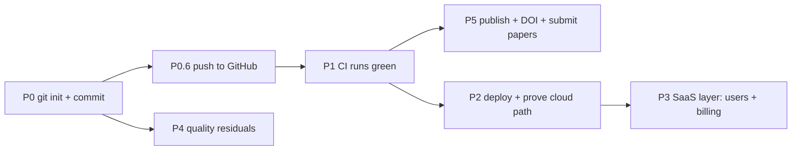

# ShieldLab G4 — Production-Readiness Roadmap (Gap Closure)

**Created:** 2026-06-30
**Owner:** Dr. Hani H. Negm
**Purpose:** Close the real gap between *code-complete with great docs* and *actually
shipped & operating*. This document complements the product/physics [ROADMAP.md](../ROADMAP.md)
(features) by focusing exclusively on **operational, deployment, and release gaps**
discovered in the 2026-06-29/30 honest assessment.

> **Why this exists.** The internal `platform_evaluation_report.md` claims "10/10
> production-ready." Independent verification showed the strong parts are real
> (215 passing tests, real security code, deep physics) but the *operational
> foundations were missing*: the project was not under version control, nothing
> was deployed, CI had never run, and the papers were unsubmitted drafts. This
> roadmap fixes that, in priority order.

---

## Legend

| Symbol | Meaning |
|--------|---------|
| 🟢 | Can be done locally & safely by the engineering agent (no credentials/cost) |
| 🟡 | Needs your credentials / a one-time decision (GitHub, Azure, ORCID) |
| 🔴 | Incurs cost or is externally irreversible (cloud spend, paper submission) |
| ✅ | Done in this cycle |
| ⏳ | In progress |
| ☐ | Not started |

---

## Gap Inventory → Status

| # | Gap (from honest assessment) | Phase | Class |
|---|------------------------------|-------|-------|
| 1 | No version control (`.git` absent) → CI never runs | P0 | 🟢 |
| 2 | Not published to GitHub; URL is `[owner]` placeholder | P0 | 🟡 |
| 3 | CI/security/release-gate workflows never executed | P1 | 🟡 |
| 4 | Nothing deployed (Bicep/AKS are templates only) | P2 | 🔴 |
| 5 | Geant4 → cloud worker path unproven end-to-end | P2 | 🔴 |
| 6 | Product/SaaS layer: real API-key auth ✅, but no user store / billing yet | P3 | 🟡 |
| 7 | RC residuals: console 404s, runtime warnings, Playwright smoke skipped | P4 | 🟢 |
| 8 | Papers unsubmitted; metadata placeholders, no DOI | P5 | 🟡/🔴 |

---

## Phase 0 — Version Control & Source Integrity  *(THE unblocker)*

**Goal:** Bring the entire codebase under git with a clean baseline so that history,
rollback, collaboration, and CI become possible. This single phase unblocks Phases 1, 3, 5.

| ID | Task | Class | Acceptance criteria |
|----|------|-------|---------------------|
| P0.1 | Verify/extend `.gitignore` (build, backups, results, secrets, tmp, generated `.mac`) | 🟢 | `git status` shows no secrets, no `build/`, no `backups/`, no `results/` |
| P0.2 | `git init`; set local identity if global unset | 🟢 | `.git/` exists; commits attributable |
| P0.3 | Stage & verify — no secret/large artifact leaks | 🟢 | Manual review of staged file list passes |
| P0.4 | Clean baseline commit `chore: baseline import of ShieldLab G4` | 🟢 | `git log` shows 1 commit; working tree clean |
| P0.5 | Create `main` branch + annotated tag `v1.0.0-rc1` | 🟢 | Tag present |
| P0.6 | Create GitHub repo + add remote + first push | 🟡 | Code visible on GitHub; default branch protected |
| P0.7 | Branch protection: require PR + green CI before merge to `main` | 🟡 | Direct pushes to `main` blocked |

**Dependencies:** none. **Status:** ✅ **P0.1–P0.7 complete** — baseline committed, pushed to GitHub (`hhnegm-wq/ShieldLabG4`), branch protection enabled on `main`.

---

## Phase 1 — CI/CD That Actually Runs

**Goal:** Prove the four existing workflows execute green on real infrastructure, so the
"security CI / release gate" claims become true rather than aspirational.

| ID | Task | Class | Acceptance criteria |
|----|------|-------|---------------------|
| P1.1 | Trigger `release-validation-gate.yml` on first push | 🟡 | Workflow runs; `ci_gate` + `science_gate` + `release_gate` all green |
| P1.2 | Trigger `security.yml` (pip-audit, Trivy, SBOM, Gitleaks) | 🟡 | No criticals; SBOM artifact produced; SARIF uploaded |
| P1.3 | Fix any failures surfaced by *real* CI (env, paths, deps) | 🟢 | All workflows green |
| P1.4 | Add CI + coverage + license status badges to `README.md` | 🟢 | Badges render and link to runs |
| P1.5 | Pin GitHub Actions to commit SHAs (supply-chain hardening) | 🟢 | All `uses:` pinned |
| P1.6 | Add Dependabot/renovate for deps + actions | 🟢 | Update PRs open automatically |

**Dependencies:** P0.6. **Status:** ✅ **P1.1–P1.6 complete** — all three workflows green (Release Validation Gate, Security Scanning, UI Smoke); actions SHA-pinned; Dependabot active; README badges added (2026-07-24).

---

## Phase 2 — Deploy & Prove the Cloud Path

**Goal:** Move from "infrastructure-as-templates" to a **running system with a live URL**
and one real Geant4 job proven end-to-end. This is the largest reality gap.

| ID | Task | Class | Acceptance criteria |
|----|------|-------|---------------------|
| P2.1 | `az deployment ... what-if` on `infra/main.bicep` | 🟡 | What-if clean; no policy violations |
| P2.2 | Provision infra (App Service plan, Web App, Storage, KV, ACR, VNet, PEs) | 🔴 | Resources created; HTTPS-only on |
| P2.3 | Deploy Streamlit UI to App Service → **live HTTPS URL** | 🔴 | Page loads; auth gate works |
| P2.4 | Build & push Geant4 worker container to ACR | 🔴 | Image in ACR; vuln scan clean |
| P2.5 | **Prove one job:** UI → queue → worker → blob result → UI render | 🔴 | A real `layer_dose.csv` returns to the UI |
| P2.6 | Wire App Insights + OTel exporter in the *live* env | 🟡 | Traces & correlation-ids visible in Azure Monitor |
| P2.7 | Configure alerts (5xx rate, queue age, DLQ depth, CPU quota) per `docs/slo.md` | 🟡 | Alerts fire in a induced-failure test |
| P2.8 | Run the DR drill from `docs/dr_runbook.md` once | 🟡 | Recovery within stated RTO/RPO |
| P2.9 | Cost guardrails: budget + spend alert | 🟡 | Budget alert configured |

**Dependencies:** P1 green, Azure subscription. **Status:** ☐ (needs your Azure go-ahead — cost).

---

## Phase 3 — Product / SaaS Layer

**Goal:** Replace the licence-key→JWT *stub* with a real tenant model so the open-core
freemium business in the product roadmap becomes operable.

| ID | Task | Class | Acceptance criteria |
|----|------|-------|---------------------|
| P3.1 | Real user store (Entra External ID / B2C **or** managed Postgres) | 🟡 | Users persist; password/SSO login works |
| P3.2 | Sign-up / sign-in / reset flows in UI | 🟢 | E2E auth journey passes a test |
| P3.3 | Billing integration (Stripe) + webhook → tier sync | 🔴 | Test-mode subscription upgrades a user to Pro |
| P3.4 | Wire metering to existing `QuotaMiddleware` (jobs/day, CPU-min) | 🟢 | Quota enforced per real tenant, not per API key only |
| P3.5 | Account/usage dashboard page | 🟢 | Shows plan, usage, invoices |
| P3.6 | Data-retention + delete-my-data (GDPR) per `docs/data_governance.md` | 🟢 | Delete request purges tenant data |

**Dependencies:** P2 (live env), Stripe account. **Status:** ☐.

---

## Phase 4 — Quality Residuals  *(from RC checklist)*

**Goal:** Clear the open FAIL items in `release_candidate_checklist_report.md` so the RC
becomes a full PASS.

| ID | Task | Class | Acceptance criteria |
|----|------|-------|---------------------|
| P4.1 | Fix float64 overflow in `gp_buildup_factor` (deep penetration) | 🟢 | No `RuntimeWarning: overflow` from `shielding_params` |
| P4.2 | Fix "No artists with labels" legend warning(s) in `comparison.py` | 🟢 | No legend `UserWarning` during page render |
| P4.3 | Resolve console 404s for static assets during navigation | 🟢 | `asset_integrity` reports 0 missing routes |
| P4.4 | Run Playwright UI smoke **non-skipped** in CI (no-skip gate) | 🟡 | `tests/test_ui_playwright_smoke.py` runs green, 0 skipped |
| P4.5 | Visual-regression baselines committed & gated | 🟢 | `tests/visual` runs in CI |
| P4.6 | Full action-by-action click-matrix coverage | 🟢 | Every conditional UI branch exercised by a test |

**Dependencies:** P0. **Status:** ✅ P4.1, ✅ P4.2 (legends pass labeled artists; UI smoke renders every page green), ✅ P4.3 (Caddy proxy rewrite implemented **and validated live** against nested `/_stcore/*` requests on 2026-07-30), ✅ P4.4 (non-skipped Playwright gate in CI via `scripts/ci_ui_smoke_gate.sh`), ✅ P4.5 (committed baseline + dedicated CI workflow), ⏳ P4.6 (click-through coverage expanded for quick-action workflow entry points, but not every conditional branch yet). 

---

## Phase 5 — Publication Readiness

**Goal:** Convert the two manuscript drafts into actual submissions.

| ID | Task | Class | Acceptance criteria |
|----|------|-------|---------------------|
| P5.1 | Make GitHub repo public + add `LICENSE` confirmation | 🟡 | Public URL resolves; license file present |
| P5.2 | Mint Zenodo DOI (GitHub→Zenodo release hook) | 🟡 | DOI badge in README & `CITATION.cff` |
| P5.3 | Fill author metadata (ORCID, institution, funding) everywhere | 🟡 | No `[placeholder]` left in manuscripts/`CITATION.cff` |
| P5.4 | Regenerate final DOCX + highlights + cover letter | 🟢 | Files present in `final/`; word counts within journal limits |
| P5.5 | Submit Paper 1 → *Computer Physics Communications* | 🔴 | Submission ID received |
| P5.6 | Submit Paper 2 → *SoftwareX* | 🔴 | Submission ID received |

**Dependencies:** P0.6 (public repo), P1 (CI green for credibility). **Status:** ☐.

---

## Critical Path (shortest route to value)

**Recommendation:** Do **P0 → P1 → P5** first (low cost, high credibility — gets the
papers out). Pursue **P2 → P3** (the SaaS) as a parallel, funded track because it carries
real cloud spend and product scope.

---

## What was executed in the 2026-06-30 cycle

- ✅ **P0.1–P0.5** — Repository placed under version control with a verified clean
  baseline commit and `v1.0.0-rc1` tag (see commit log).
- ✅ **P4.1** — Overflow-safe G-P buildup factor (`gp_buildup_factor`), log-space
  evaluation; valid-domain values unchanged.
- ✅ This roadmap authored.

## What was executed in the 2026-07-24 cycle

- ✅ **P0.6 / P0.7** — Pushed to GitHub (`hhnegm-wq/ShieldLabG4`); branch protection on
  `main` (required `release-gate` check, PR flow, no force-push/delete).
- ✅ **P1.1–P1.6** — All three workflows run **green** (Release Validation Gate,
  Security Scanning, UI Smoke); GitHub Actions **SHA-pinned**; **Dependabot** active;
  **P1.4** CI + license + Python badges added to `README.md`.
- ✅ **P4.4** — Playwright UI smoke runs **non-skipped** in CI with a no-skip gate
  (`scripts/ci_ui_smoke_gate.sh` sets `SHIELDLAB_UI_SMOKE=1` and fails on any skip).
- ✅ **P4.2** — Comparison-page legends always pass labeled artists; UI smoke renders
  every page green (no legend crash).
- ✅ **Cloud-free deployment path (new, beyond the original roadmap)** — pluggable
  `shieldlab.backends` (LocalBackend = SQLite + filesystem; AzureBackend preserved) and
  a one-command **Docker Compose** stack (UI + API + worker), validated end-to-end on
  Docker (submit → worker → artifact → result). See `deploy/free-tier-oracle.md`.
- ✅ **Security hardening (new)** — fixed an API 500 (uuid), verified no worker shell
  injection, added an **auto-HTTPS Caddy reverse proxy** (opt-in `proxy` profile) plus
  an outermost **per-IP flood/brute-force throttle**; secure-by-default API keys and
  full OWASP security headers. Full suite **238 passing**; CI green.

## What was executed in the 2026-07-28 cycle

- ✅ **P4.3 investigation** — Confirmed the residual root cause: direct loads of
  Streamlit nested page paths (for example `/study_builder`) generate follow-on
  requests such as `/study_builder/_stcore/health` and `/study_builder/_stcore/host-config`,
  producing console 404s even though the page renders correctly.
- ✅ **Navigation test hardening** — `tests/test_ui_playwright_smoke.py` now uses the
  shared navigation contract (`visible_page_specs()` / `page_href()`) instead of
  stale hard-coded page lists, and `tests/visual/test_visual_regression.py` now
  does the same for the results explorer route.
- ✅ **P4.5** — Promoted historical stable screenshots into a committed
  `tests/visual/baseline/` set and turned `tests/visual/test_visual_regression.py`
  into an exact pixel baseline gate. Added a dedicated `visual-regression.yml`
  CI workflow plus failure artifact upload.
- ⏳ **P4.3 advanced** — The failed `/?page=...` route substitution was reverted,
  and the likely real fix was implemented at the proxy layer in `deploy/Caddyfile`:
  nested requests like `/study_builder/_stcore/health` are rewritten to
  `/_stcore/health` before proxying to Streamlit. This is implemented and unit-tested,
  but end-to-end execution still needs a Docker-enabled host because Docker Desktop
  is currently unavailable in this environment.
- ⏳ **P4.6 advanced** — Added Playwright quick-action click-through coverage for the
  three primary workflow entry points (Configure Study, Run Study, Review Results),
  so the gate now covers actual in-app navigation clicks instead of only direct loads.

## What was executed in the 2026-07-30 cycle

- ✅ **P4.3 closed** — Started Docker Desktop, rebuilt the stack, launched the
  Caddy proxy profile, and validated end-to-end that direct nested requests such
  as `/study_builder/_stcore/health` and `/settings/_stcore/host-config` return
  HTTP 200 through the proxy instead of 404.
- ✅ **P3 advanced (hosted auth scaffolding)** — Added optional Supabase-backed
  hosted user authentication and role/tier mapping to the UI, deployment env
  pass-throughs for Docker and App Service, auth tests, and `deploy/supabase_init.sql`.
  This is code-complete and CI-green, but still blocked externally by Supabase
  free-project capacity / billing choice before a real hosted project can be used.

## What needs your go-ahead next

1. 🔴 **Azure (P2):** approve provisioning — carries cloud spend; deferred by you to a
   later step. I will run `what-if` first when you're ready.
2. 🟡 **Product/SaaS (P3):** decide the user store (Entra External ID / B2C or managed
   Postgres) and provide a Stripe account for billing.
3. 🟡 **Publication (P5):** make the repo public, mint a Zenodo DOI, and supply ORCID /
   institution / funding strings; then approve the (irreversible) journal submissions.
