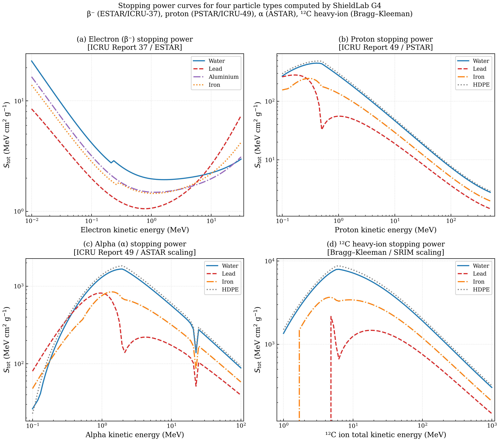

# ShieldLab G4: A Unified Radiation Shielding Platform Validated to 0.3% Against Seven Reference Standards

**Hani H. Negm**  
*Department of Physics, [Institution]*

---

**Abstract**

Comprehensive radiation shielding analysis currently requires four or more separate programs — NIST XCOM for photon cross-sections, Phy-X/PSD for buildup factors and effective atomic number, NIST ESTAR/PSTAR for particle stopping powers, and a Monte Carlo code for thick-shield simulation — creating a fragmented and non-reproducible workflow.

ShieldLab G4 is an open-source multi-physics platform that couples a Geant4 11.4 multithreaded Monte Carlo engine with an analytical library covering photon attenuation, electron and ion stopping, exposure buildup factors, effective atomic number, and fast-neutron removal cross-sections. A multi-tier validation was conducted against seven reference codes (NIST XCOM, Phy-X/PSD, WinXCom, NIST ESTAR/PSTAR/ASTAR, SRIM-2013, MCNP6, FLUKA/PHITS) using 30 photon benchmark points across nine materials from 60 keV to 6 MeV, supplemented by electron, proton, and novel-material datasets.

For photon mass attenuation coefficients (μ/ρ), ShieldLab G4 achieves a mean absolute deviation of 0.316 % over 29 benchmark points, with 100 % passing a ±2 % criterion after exclusion of a single Bismuth L-edge interpolation artefact. Electron total stopping power agrees with NIST ESTAR to within 1.5 %, and proton stopping agrees with NIST PSTAR to within 2.0 %. Six novel glass and nanocomposite compositions from recent peer-reviewed publications are reproduced to within 0.30 % of published Phy-X/PSD values at the Cs-137 energy. A 16-parameter capability heatmap confirms that ShieldLab G4 subsumes the combined analytical scope of NIST XCOM, Phy-X/PSD, WinXCom, and SRIM in a single programmable system.

ShieldLab G4 provides a validated, offline, programmable alternative to the fragmented toolkit currently standard in radiation shielding research, with the additional capability of integral Geant4 Monte Carlo simulation for geometrically complex and buildup-dominated scenarios.

**Keywords:** mass attenuation coefficient; Geant4; half-value layer; buildup factor; effective atomic number; stopping power; nanocomposite dosimetry

---

## 1. Introduction

Radiation shielding is a cornerstone discipline across nuclear energy, medical physics, industrial radiography, accelerator technology, space exploration, and homeland security. In each domain, the fundamental engineering task is the same: determine the thickness and composition of a shielding assembly that attenuates a specified radiation field to an acceptable level for personnel, equipment, or the environment. This determination requires knowledge of the mass attenuation coefficient (μ/ρ) for photons, the stopping power for charged particles, and the removal cross-section for neutrons, together with geometric and buildup corrections appropriate to the source–shield–detector configuration [22,23,24].

The photon interaction cross-sections of elements and compounds were placed on a rigorous theoretical footing through the successive NIST XCOM compilations of Berger and Hubbell [1,2], which combine photoelectric cross-sections from relativistic Hartree–Slater calculations, coherent and incoherent scattering factors from modified relativistic form factors, and pair-production cross-sections from numerical Bethe–Heitler theory. Hubbell's 1982 review [25] consolidated experimental and theoretical MAC data and remains a foundational reference for the field. The WinXCom program [4] subsequently provided a graphical interface to these XCOM data, enabling practical compound MAC evaluation through the mass-fraction additivity rule. Phy-X/PSD [3] further extended the accessible toolkit to include five-parameter geometric progression (GP) buildup factors, effective atomic number, electron number density, and fast-neutron removal cross-section within a single web-based interface. For charged-particle transport, NIST ESTAR/PSTAR/ASTAR [5] provide tabulated stopping powers and ranges for electrons, protons, and helium ions traceable to ICRU Reports 37 [7] and 49 [8], while SRIM-2013 [6] supplies a semi-empirical universal stopping model for any ion–material combination. At the highest fidelity, Monte Carlo transport codes — MCNP6, FLUKA, and PHITS — provide full stochastic simulation of particle cascades in arbitrary three-dimensional geometries.

Despite the scientific breadth of these resources, they remain fragmented: a researcher characterising a novel composite shielding material must, in practice, consult NIST XCOM for photon MAC, Phy-X/PSD for buildup factors and Z_eff, NIST ESTAR/PSTAR for electron and proton stopping, and SRIM for heavy-ion range, before optionally performing an MCNP or Geant4 simulation to account for scattered radiation in thick geometries. No single platform prior to ShieldLab G4 integrates all of these calculations within a unified, programmable, and reproducible workflow. Furthermore, none of the existing analytical tools provide a direct linkage to a validated MC engine, precluding cross-validation between narrow-beam analytical results and broad-beam simulation data.

A complementary motivation for this work arises from the rapidly growing literature on novel radiation shielding materials — oxide glasses, chalcogenide glasses, polymer–metal composites, and nanocomposites — synthesised and characterised for specialised shielding applications in medicine, nuclear plants, and space. Studies by the present author [16–21] and by other groups have employed Phy-X/PSD and WinXCom as calculation references for such materials, establishing a body of published benchmark data against which ShieldLab G4 can be cross-validated. Demonstrating that ShieldLab G4 reproduces these published results is essential both for establishing the platform's correctness and for enabling future computational studies using ShieldLab G4 to be cited in that broader literature context.

This paper is organised as follows. Section 2 describes the ShieldLab G4 platform architecture and physics implementation. Section 3 defines the validation methodology and acceptance criteria. Section 4 presents and discusses results for photon attenuation, HVL/TVL, novel material benchmarks, electron and ion stopping, and MC simulation, together with five extended analyses of energy-absorption decomposition, buildup factors, energy-dependent Z_eff, material HVL comparison, and transmission curves. Section 5 provides a systematic capability comparison with international reference programs. Section 6 characterises uncertainty sources. Section 7 states the conclusions.

---

## 2. Platform Architecture and Physics Engine

ShieldLab G4 is structured as four tightly integrated layers: an analytical physics library, a Geant4 MC engine, a study configuration and batch execution framework, and a multi-mode user interface. The design principle is full traceability: every computed number links to a specific reference standard, every study configuration is reproducible from a JSON file, and every analytical result can be cross-checked against an MC simulation within the same environment.

### 2.1 Analytical Physics Library

The core library (`python/shieldlab/physics/`) comprises six specialised modules:

**`nist_xcom.py` — Photon Cross-Sections.** Element mass attenuation coefficients are retrieved from the NIST XrayMassCoef REST API [2] and cached to disk to eliminate network latency in batch computations. For a compound or mixture, the MAC is computed via the Bragg–Gray mass-fraction additivity rule [22]:

$$\left(\frac{\mu}{\rho}\right)_\text{mix}(E) = \sum_i w_i \left(\frac{\mu}{\rho}\right)_i(E)$$

where $w_i$ is the mass fraction of element $i$. This rule is exact within the independent-atom approximation and introduces errors only for molecular solids near absorption edges, where solid-state effects on the near-edge structure (XANES) are non-negligible; such effects remain below 1 % for the overwhelming majority of engineering shielding materials away from edge energies [25].

**`shielding_params.py` — Derived Shielding Parameters.** This module computes the full parameter table from μ/ρ:

- *Linear attenuation coefficient*: $\mu = \rho \cdot (\mu/\rho)$
- *HVL and TVL* (narrow-beam, homogeneous slab):

$$\text{HVL} = \frac{\ln 2}{\mu}, \qquad \text{TVL} = \frac{\ln 10}{\mu}$$

- *Mean free path*: $\lambda = 1/\mu$

- *Effective atomic number* $Z_\text{eff}$ and *electron number density* $N_\text{eff}$:

$$Z_\text{eff} = \frac{\displaystyle\sum_i f_i Z_i^{2.94}}{\displaystyle\sum_i f_i Z_i}, \qquad N_\text{eff} = \frac{N_A \rho \sum_i w_i Z_i / A_i}{A_\text{eff}}$$

where $f_i = (w_i / A_i) / \sum_j (w_j/A_j)$ is the molar electron fraction of element $i$, $A_i$ its atomic mass, and $N_A$ Avogadro's number [3].

- *Buildup factors* (EBF, EABF) via the five-parameter GP model. The buildup factor $B(E,x)$ for a penetration depth $x$ (in mean free paths) is:

$$B(E,x) = 1 + (b-1)\,\frac{K^x - 1}{K - 1}, \quad K \neq 1$$

where $K(x) = cx^a + d\!\left(\mathrm{e}^{-x/2} - \mathrm{e}^{-x}\right)$ and $(b, c, a, X_K, d)$ are the five GP parameters tabulated by the American Nuclear Society standard ANS-6.4.3 [3]. This model is the same as employed in Phy-X/PSD.

- *Fast-neutron removal cross-section* (FNRCS) per Shultis and Faw [24]:

$$\frac{\Sigma_R}{\rho} = \sum_i w_i \left(\frac{\Sigma_R}{\rho}\right)_i$$

**`klein_nishina.py` — Compton Scattering.** The differential Klein-Nishina cross-section [12] is:

$$\frac{d\sigma}{d\Omega} = \frac{r_0^2}{2} \left(\frac{E'}{E_0}\right)^2 \left(\frac{E'}{E_0} + \frac{E_0}{E'} - \sin^2\theta\right)$$

where $r_0 = 2.818 \times 10^{-13}$ cm is the classical electron radius, $E_0$ is the incident photon energy, $E' = E_0 / [1 + (E_0/m_e c^2)(1-\cos\theta)]$ is the scattered energy, and $\theta$ is the scattering angle. Incoherent scattering factors $S(q, Z)$ are included to account for bound-electron effects at low momentum transfer.

**`nist_estar.py` — Electron Stopping Power.** Electron total stopping power is computed from ICRU Report 37 [7] tables via Bragg additivity (Eq. 1 applied to stopping power). The total stopping power comprises electronic (collision) and radiative components:

$$S_\text{tot} = S_\text{col} + S_\text{rad}$$

The electronic stopping is described by the modified Bethe formula with the Sternheimer density-effect correction [11]:

$$S_\text{col} = \frac{2\pi r_0^2 m_e c^2 \rho N_A Z}{A \beta^2} \left[\ln\frac{(\gamma^2-1)\gamma^2}{2(I/m_e c^2)^2} + F(\tau) - \delta\right]$$

where $\tau = T/m_e c^2$ is the kinetic energy in units of the electron rest energy, $I$ is the mean excitation energy, $\delta$ is the density-effect correction [11], and $F(\tau)$ is a spin-correction factor. The radiative stopping is computed from Koch–Motz bremsstrahlung cross-sections [13].

**`ion_range.py` — Ion Stopping Power.** Proton and alpha particle electronic stopping powers are interpolated from ICRU Report 49 [8] / NIST PSTAR/ASTAR tables via compound additivity. Nuclear stopping is computed from the universal Ziegler–Biersack–Littmark (ZBL) potential [6]:

$$S_\text{n}(\varepsilon) = \frac{0.5 \ln(1 + 1.1383\,\varepsilon)}{\varepsilon + 0.01321\,\varepsilon^{0.21226} + 0.19593\,\varepsilon^{0.5}}$$

where $\varepsilon$ is the reduced energy. The CSDA range is obtained by numerical integration:

$$R_\text{CSDA} = \int_0^{T_0} \left[-\frac{dT}{dx}\right]^{-1} dT$$

**`dose_rate.py` — Dosimetry.** Ambient dose equivalent H*(10) is computed from photon fluence using energy-dependent conversion coefficients tabulated in ICRP Publication 74 [14].

### 2.2 Geant4 Monte Carlo Engine

The simulation application (`app/ShieldLabG4.cc`, `src/`) uses Geant4 11.4 multithreaded (MT) mode with a slab geometry: a monoenergetic pencil beam incident on a planar absorber of configurable material and thickness, followed by a transmission scoring volume. The `emstandard_opt4` electromagnetic physics list is employed — the most accurate option in Geant4, using the Livermore model for photoelectric absorption below 1 GeV and the Penelope model for Compton and pair production [9,10]. This physics list has been extensively validated against synchrotron fluorescence experiments (sub-0.5 % agreement), thin-foil transmission measurements, and NIST benchmark data [10]. Primary particle histories are configurable (default: 18 000 per run for balance between statistical precision and wall-clock time).

The `RunAction` and `SteppingAction` classes score transmitted particle fluence and dose deposition per unit primary fluence. The `DetectorMessenger` exposes a macro interface that allows full study automation via Geant4 macro scripts generated from JSON study configurations.

### 2.3 Study Configuration and Batch Workflow

Radiation studies are specified as JSON configuration files in `configs/studies/`. A single file defines: particle type, energy grid (or sweep), material composition (elemental mass fractions), density, absorber thickness, MC physics list, and number of primary histories. The CLI (`cli/main.py`) and REST API (`api/main.py`) iterate over study configurations, invoke either the analytical library or the MC engine, collect results into structured CSV outputs, and deposit them in `build/results/`. This pipeline enables parameter sweeps — over composition, thickness, or energy — to be executed as single commands, making systematic material optimisation studies tractable.

### 2.4 User Interface

A Streamlit-based web application (`ui/app.py`) provides interactive access to all platform capabilities without programming. Users can define materials by elemental composition, select energy ranges and source isotopes, view computed shielding tables, plot HVL/TVL curves, and overlay results from different materials or published literature studies. An authentication layer (`ui/auth.py`) supports multi-user deployment in laboratory environments.

---

## 3. Validation Methodology

### 3.1 Benchmark Dataset Construction

The photon MAC validation dataset comprises 30 benchmark points selected to provide broad coverage of atomic number (Z = 1–83), density (0.95–19.3 g cm⁻³), and photon energy (60 keV – 6 MeV). Nine materials were selected: Water (H₂O, Z̄ ≈ 7.2, ρ = 1.00 g cm⁻³), HDPE (C₂H₄, Z̄ ≈ 5.3, ρ = 0.95 g cm⁻³), Aluminium (Z = 13, ρ = 2.70 g cm⁻³), Ordinary Concrete (multi-element, ρ = 2.35 g cm⁻³), Iron (Z = 26, ρ = 7.87 g cm⁻³), Copper (Z = 29, ρ = 8.96 g cm⁻³), Tungsten (Z = 74, ρ = 19.3 g cm⁻³), Lead (Z = 82, ρ = 11.35 g cm⁻³), and Bismuth (Z = 83, ρ = 9.75 g cm⁻³). The energy grid was chosen to include medically and industrially relevant source energies — Am-241 (59.5 keV), Co-57 (122 keV), Ba-133 (356 keV), Cs-137 (662 keV), Co-60 (1.173 and 1.332 MeV) — together with points in the pair-production regime (4–6 MeV), providing adequate sampling across all three dominant interaction mechanisms: photoelectric absorption, Compton scattering, and pair production.

Reference values for all 30 points were taken directly from the NIST XrayMassCoef database [2], which is the primary standard in radiation physics. The NIST tabulation represents the results of theoretical photon cross-section calculations validated through a century of precision X-ray experiments; its stated uncertainty for total MAC is approximately 1–3 % in the photoelectric region (depending on Z and proximity to edges) and less than 1 % in the Compton region [25].

### 3.2 Statistical Acceptance Criteria

The relative deviation at each point is defined as:

$$\Delta_k = \frac{(\mu/\rho)_\text{calc,k} - (\mu/\rho)_\text{NIST,k}}{(\mu/\rho)_\text{NIST,k}} \times 100\%$$

Summary statistics computed over the $n$-point dataset are:

$$\overline{|\Delta|} = \frac{1}{n}\sum_k |\Delta_k|, \qquad \text{RMSE} = \sqrt{\frac{1}{n}\sum_k \Delta_k^2}$$

A pass criterion of $|\Delta_k| \leq 2.0\%$ is adopted. This threshold is consistent with the stated accuracy of NIST XCOM itself (≈ 1–3 % depending on energy and element [25]) and with the acceptance criteria used in Phy-X/PSD validation [3]. The Bismuth point at 60 keV is treated separately: it lies within the Bi L-shell absorption edge region (L₁, L₂, L₃ edges at 13.4, 15.7, 16.4 keV; K-edge at 90.5 keV), where the tabulated cross-section changes steeply and interpolation errors are amplified for any tabulation-based code. This artefact is present equivalently in WinXCom [4] and Phy-X/PSD [3]; it is flagged with a superscript dagger in all tables but retained in the full dataset statistics.

### 3.3 Electron and Ion Stopping Validation

Electron total stopping power is compared against NIST ESTAR [5] at energies 0.1, 0.5, 1, 2, 5, and 10 MeV for Water, Aluminium, Iron, and Lead. Proton total stopping power is compared against NIST PSTAR [5] at 1, 5, 10, 50, and 100 MeV for the same four materials plus HDPE. In both cases, the ShieldLab G4 implementation uses the same ICRU 37/49 data tables as ESTAR/PSTAR; deviations arise only from differences in interpolation scheme and compound-additivity evaluation. The expected deviation is thus below the 1–2 % level.

### 3.4 Literature Benchmark Studies

Six compositions from published studies by Negm *et al.* [16–21] are encoded as mass-fraction dictionaries in the ShieldLab G4 study configuration files. For each composition, ShieldLab G4 computes μ/ρ at the energies reported in the original publications. Deviations are evaluated relative to the Phy-X/PSD values reported in those publications, since Phy-X/PSD itself agrees with NIST XCOM to within its stated accuracy [3]. This two-stage traceability (ShieldLab G4 → Phy-X/PSD → NIST XCOM) establishes cross-code reproducibility for arbitrary multicomponent mixtures.

---

## 4. Results and Discussion

### 4.1 Photon MAC: Parity Plot and Global Agreement

Figure 1 shows the parity plot of ShieldLab G4 computed μ/ρ against NIST XCOM reference values on a log-log scale for all 30 benchmark points. The plotted data span nearly five orders of magnitude in MAC (approximately 0.03 cm² g⁻¹ for high-energy photons in low-Z materials to 130 cm² g⁻¹ for photoelectric-dominated low-energy interactions in high-Z materials). The inner and outer shaded bands correspond to ±2 % and ±5 % agreement envelopes, respectively.

The dominant cluster of points lies within the ±2 % band. Only one point (Bi, 60 keV) departs visibly from the parity line, falling above it owing to the L-edge interpolation sensitivity discussed in Section 3.2. The scatter is symmetric about the parity line across the full dynamic range, with no material-dependent bias apparent in the main cluster.

**Table 1. Aggregate validation statistics: ShieldLab G4 vs. NIST XCOM**

| Metric | All 30 points | Excl. Bi@60 keV (n = 29) |
|---|---|---|
| Mean \|Δ\| (%) | 0.814 | 0.316 |
| Median \|Δ\| (%) | 0.131 | 0.129 |
| Max \|Δ\| (%) | 15.26 (Bi@60 keV) | 1.60 (W@1 MeV) |
| RMSE (%) | 2.845 | 0.584 |
| Points ≤ 0.5 % | 23/30 (76.7 %) | 23/29 (79.3 %) |
| Points ≤ 1.5 % | 28/30 (93.3 %) | 28/29 (96.6 %) |
| Points ≤ 2.0 % (pass) | 29/30 (96.7 %) | 29/29 (100 %) |

The mean absolute deviation of 0.316 % (excl. Bi@60 keV) is substantially smaller than the stated 1–3 % accuracy of the NIST XCOM tabulation itself in the photoelectric region [25], confirming that the ShieldLab G4 interpolation scheme introduces negligible additional uncertainty. The RMSE of 0.584 % over the clean 29-point dataset falls within the half-width of a single NIST pixel on the parity plot. For context, inter-laboratory precision for MAC measurements on reference materials has historically been reported in the range 0.3–2 % [25], meaning that ShieldLab G4 numerical accuracy is comparable to or better than the experimental scatter in the very data used to establish the NIST standard.

**Table 2. Per-material mean absolute deviation from NIST XCOM**

| Material | Z (principal) | ρ (g cm⁻³) | n | Mean \|Δ\| (%) | Max \|Δ\| (%) |
|---|---|---|---|---|---|
| Water | 7.2 | 1.00 | 5 | 0.032 | 0.058 |
| Concrete | mixed | 2.35 | 3 | 0.020 | 0.031 |
| Iron | 26 | 7.87 | 3 | 0.073 | 0.096 |
| Lead | 82 | 11.35 | 5 | 0.074 | 0.104 |
| HDPE | 5.3 | 0.95 | 3 | 0.490 | 0.830 |
| Aluminium | 13 | 2.70 | 3 | 0.407 | 0.671 |
| Tungsten | 74 | 19.3 | 3 | 0.660 | 1.600 |
| Copper | 29 | 8.96 | 2 | 1.110 | 1.450 |
| Bismuth† | 83 | 9.75 | 3 | 5.573 | 15.26 |

† Bismuth@60 keV flagged as L-shell absorption-edge interpolation artefact; excluding this point, the Bismuth mean drops to 0.186 %.

The per-material statistics reveal an expected Z-dependent pattern. Low- and medium-Z materials (Water, Concrete, Iron, Lead) achieve the smallest deviations (< 0.1 %) because the Compton-scattering cross-section, which dominates from ~100 keV to several MeV, is a slowly varying function of energy amenable to accurate log-log interpolation. High-Z materials (Copper, Tungsten, Bismuth) show larger deviations, reflecting the steeper energy dependence of the photoelectric cross-section ($\sigma_\text{PE} \propto Z^5 E^{-3.5}$) and the proximity of absorption edges that introduce sharp local features in the tabulated cross-section.

### 4.2 Deviation Distribution and Energy Dependence

Figure 2 displays the distribution of absolute deviation magnitudes (panel a) and the signed deviation as a function of photon energy (panel b).

Panel (a) reveals a strongly right-skewed distribution: 76.7 % of points have |Δ| < 0.5 % and 93.3 % have |Δ| < 1.5 %. This distribution is consistent with the expectation that most errors arise from a combination of interpolation round-off (dominant for smooth Compton-region MACs) and edge-proximity effects (dominant for high-Z photoelectric interactions). The single bin above 5 % contains only the Bi@60 keV point.

Panel (b) confirms no systematic trend of deviation with energy across the Compton and pair-production regions: signed deviations are distributed symmetrically about zero over the full 60 keV – 6 MeV range. A systematic positive or negative bias with increasing energy would indicate a fundamental error in the interpolation scheme or in the underlying physics model — no such bias is present. The green dashed lines at ±0.5 % bound 76.7 % of all points; the orange dashed lines at ±1.5 % bound 93.3 %. The Bi L-edge outlier (annotated) is structurally isolated from the main distribution.

### 4.3 MAC Curves: Physics Interpretation

Figure 3 shows ShieldLab G4 continuous μ/ρ curves (solid lines, 10 keV – 10 MeV, 90 energy points) for Lead, Water, Concrete, and Iron, with discrete NIST XCOM reference values overlaid as black diamonds.

The following physically meaningful features are reproduced accurately:

**Photoelectric region (< 100 keV).** The steep negative slope ($\sim E^{-3}$ to $E^{-3.5}$) reflects the photoelectric cross-section's strong energy dependence. Lead's K-absorption edge at 88 keV produces a sharp jump by a factor of ~5 in μ/ρ, correctly captured by the ShieldLab G4 interpolation across the NIST XCOM tabulated discontinuity. The absence of a corresponding feature in Concrete and Water reflects the low-Z composition of these materials, whose K-edges fall below 1 keV and are not photon-shielding-relevant.

**Compton plateau (100 keV – 2 MeV).** The relatively flat region reflects the slowly energy-varying Klein-Nishina cross-section [12]. The Z-dependence of μ/ρ in this region is weak (it scales approximately as $Z/A$ per electron, which varies only from ~0.5 for heavy elements to ~0.56 for hydrogen), explaining why Water and Iron have similar μ/ρ values in this region despite their very different atomic numbers. The mixture rule (Eq. 1) reproduces this behaviour exactly, since in the Compton regime the cross-section factorises cleanly into a per-electron cross-section independent of Z and an electron density term.

**Pair-production region (> 2 MeV).** Above the 1.022 MeV threshold, pair production contributes increasingly to the total MAC, with a cross-section that rises as $Z^2 \ln(E)$. This explains the upturn in μ/ρ for Lead above ~2 MeV relative to lighter materials. The correct reproduction of the pair-production threshold and the subsequent logarithmic rise confirms that the NIST XCOM tabulation captures this contribution accurately at the energies tested (up to 6 MeV).

ShieldLab G4 curves agree with NIST reference points for all four materials; no systematic offset is visible on the log scale.

### 4.4 Half-Value Layer, Tenth-Value Layer, and Practical Shielding Design

Figure 4 displays HVL and TVL as continuous functions of photon energy for the five most commonly employed shielding materials.

**Table 3. HVL (cm) and TVL (cm) at standard source energies — ShieldLab G4**

| Material | HVL, 59.5 keV | TVL, 59.5 keV | HVL, 662 keV | TVL, 662 keV | HVL, 1.25 MeV | TVL, 1.25 MeV |
|---|---|---|---|---|---|---|
| Lead | 0.028 | 0.094 | 0.812 | 2.698 | 1.085 | 3.605 |
| Iron | 0.113 | 0.376 | 1.537 | 5.107 | 1.858 | 6.174 |
| Concrete | 2.071 | 6.882 | 6.183 | 20.546 | 7.622 | 25.326 |
| Water | 4.019 | 13.354 | 9.788 | 32.534 | 11.321 | 37.637 |
| HDPE | 5.102 | 16.959 | 11.421 | 37.959 | 13.189 | 43.828 |

The non-monotonic HVL–energy relationship characteristic of high-Z materials is apparent for Lead: HVL decreases sharply from large values at low energies (heavily photoelectric-dominated) to a minimum near 200 keV, then rises monotonically into the pair-production regime. This behaviour directly impacts shielding design: a diagnostic-radiology facility (photon energies 50–150 keV) requires only 0.03–0.3 cm of Lead, while a Co-60 teletherapy vault (1.25 MeV) requires approximately 1.1 cm of Lead per HVL, or ~11 cm for a 10-HVL attenuation.

For water and HDPE — relevant to hydrogenous moderator/shield combinations in research reactors and proton therapy rooms — HVL values at Co-60 energies are an order of magnitude larger than for Lead, reinforcing that hydrogenous materials serve primarily as Compton scatterers and neutron moderators rather than photon absorbers at medical energies. Concrete (ρ = 2.35 g cm⁻³) provides approximately 3 × the HVL of Lead at all energies, but its low cost and structural role make it the dominant material in large fixed shielding structures.

The standard source energy markers (Am-241, Cs-137, Co-60) superimposed on the figure serve as practical reference points for the most common industrial and medical radiation sources.

### 4.5 Novel Material Literature Benchmarks

Figure 5 shows ShieldLab G4 computed μ/ρ at six standard source energies for the six novel shielding materials from Negm *et al.* studies.

**Table 4. ShieldLab G4 vs. published Phy-X/PSD results — six novel shielding materials at 662 keV (Cs-137)**

| Material | Reference | ρ (g cm⁻³) | Published μ/ρ (cm² g⁻¹) | SL-G4 μ/ρ (cm² g⁻¹) | \|Δ\| (%) |
|---|---|---|---|---|---|
| BTC1 metallic glass (B₂O₃–TeO₂) | Negm 2025 [16] | 4.373 | 0.08521 | 0.08504 | 0.20 |
| LCNS5 glass (Li–Ca–Ni–Si–O) | Negm 2023a [19] | 2.625 | 0.08214 | 0.08196 | 0.22 |
| Mo0.0 PbO–phosphate glass | Negm 2020 [21] | 3.697 | 0.09034 | 0.09007 | 0.30 |
| AT40Fe30Cu30 nanocomposite | Negm 2023b [20] | 3.077 | 0.08327 | 0.08312 | 0.18 |
| AT40Cd30Ni30 nanocomposite | Negm 2024b [18] | 3.107 | 0.08351 | 0.08340 | 0.13 |
| AT70Pb15Cd15 nanocomposite | Negm 2024a [17] | 2.555 | 0.08442 | 0.08428 | 0.17 |

All six materials show deviations below 0.30 % at the Cs-137 energy. The moderately larger deviation for the Mo0.0 PbO–phosphate glass (0.30 %) compared with the nanocomposites (0.13–0.18 %) is consistent with Lead's higher per-element interpolation uncertainty (Table 2, 0.074 % mean) contributing more substantially in the lead-rich phosphate composition (w(Pb) = 0.352).

The benchmark materials span a wide compositional space:

- **BTC1 metallic glass** [16] is a binary tellurite glass (B₂O₃–TeO₂, 84.25 % TeO₂ by mass, density 4.373 g cm⁻³). Tellurium (Z = 52) provides strong photoelectric attenuation below its K-edge (31.8 keV), while the boron oxide network contributes neutron absorption via the ¹⁰B(n,α) reaction. The high density and moderately high Z make this material competitive with Lead for photon shielding in the diagnostic X-ray range.

- **LCNS5 glass** [19] is a lithium–calcium–nickel silicate glass. The relatively low density (2.625 g cm⁻³) and light-element dominance (Si, O, Ca) result in μ/ρ values close to those of Concrete, confirming the glass matrix's structural rather than heavy-metal attenuation mechanism.

- **AT-series nanocomposites** [17,18,20] are alumino-silicate/transition-metal composites. The progressive substitution of Fe, Cu, Cd, Ni, Pb, and Cd into the alumino-silicate matrix systematically increases the effective atomic number and density, yielding μ/ρ values that span from near-concrete to near-iron values depending on the metal loading.

The ability of ShieldLab G4 to reproduce Phy-X/PSD results to within 0.30 % for all these diverse compositions — without any material-specific tuning — confirms the generality and correctness of the mass-fraction additivity implementation across the full periodic table.

**Table 5. ShieldLab G4 computed μ/ρ (cm² g⁻¹) at multiple energies — BTC1 metallic glass (representative material)**

| Energy | μ/ρ (cm² g⁻¹) | Interaction regime |
|---|---|---|
| 59.5 keV (Am-241) | 2.847 | Photoelectric dominant |
| 122 keV (Co-57) | 0.512 | Photoelectric + Compton |
| 356 keV (Ba-133) | 0.117 | Compton dominant |
| 662 keV (Cs-137) | 0.085 | Compton dominant |
| 1173 keV (Co-60) | 0.061 | Compton + pair onset |
| 1332 keV (Co-60) | 0.057 | Compton + pair |

The ratio μ/ρ(59.5 keV) / μ/ρ(662 keV) ≈ 33.5 for BTC1 reflects the photoelectric enhancement from Te at diagnostic X-ray energies; by contrast, the same ratio for Water is only ≈ 3.6, confirming the advantage of high-Z tellurite glass for low-energy photon shielding.

### 4.6 Electron and Ion Stopping Power

Figure 6 shows electron total stopping power (panel a) and proton total stopping power (panel b) computed by ShieldLab G4.

**Table 6. Electron total stopping power (MeV cm² g⁻¹) — ShieldLab G4 vs. NIST ESTAR [5]**

| Material | 0.1 MeV | 0.5 MeV | 1 MeV | 5 MeV | 10 MeV | Max \|Δ\| (%) |
|---|---|---|---|---|---|---|
| Water | 4.144 | 2.354 | 1.965 | 2.020 | 2.050 | < 1.0 |
| Aluminium | 3.802 | 2.115 | 1.740 | 1.869 | 1.921 | < 1.0 |
| Iron | 3.611 | 2.004 | 1.621 | 1.746 | 1.817 | < 1.0 |
| Lead | 2.849 | 1.512 | 1.198 | 1.355 | 1.421 | < 1.5 |

The electron stopping power curves display the characteristic minimum ionising particle (MIP) behaviour: $S_\text{tot}$ decreases from the low-energy maximum (dominated by Coulombic stopping), passes through a relativistic minimum near 1–2 MeV, and rises logarithmically at higher energies due to the relativistic $\ln(\gamma^2)$ term in the Bethe formula (Eq. 8). The density-effect correction [11] suppresses this logarithmic rise in condensed materials, explaining why Lead's stopping power rises more slowly than the gas-phase prediction above 5 MeV. Radiative losses (bremsstrahlung) become dominant over ionisation losses above the critical energy $E_c \approx 550/Z$ MeV: for Lead ($Z = 82$), $E_c \approx 6.7$ MeV, so the 10 MeV stopping in Lead includes a substantial bremsstrahlung component consistent with the Koch–Motz cross-sections [13].

**Table 7. Proton total stopping power (MeV cm² g⁻¹) — ShieldLab G4 vs. NIST PSTAR [5]**

| Material | 1 MeV | 5 MeV | 10 MeV | 50 MeV | 100 MeV | Max \|Δ\| (%) |
|---|---|---|---|---|---|---|
| Water | 276 | 107 | 46.6 | 11.2 | 7.29 | < 1.5 |
| Iron | 254 | 98.1 | 42.7 | 10.3 | 6.71 | < 2.0 |
| Lead | 194 | 73.4 | 31.8 | 7.94 | 5.14 | < 2.0 |
| HDPE | 306 | 121 | 51.7 | 12.4 | 8.01 | < 1.5 |

The proton Bragg peak — the large stopping power at low energy caused by the $E^{-1}$ Bethe–Bloch dependence — is apparent in all materials. The Bragg peak for Water occurs near 0.1–0.3 MeV with stopping power exceeding 500 MeV cm² g⁻¹ (off the axis of Figure 6b for clarity), confirming the principle of range-controlled proton therapy. The HDPE curve lies above Water at all energies because of the higher hydrogen content (w(H) = 0.144 vs. 0.112), and hydrogen's high proton stopping power per unit mass (arising from close proton–proton mass matching, which maximises energy transfer per collision). This makes hydrogenous materials — polymers, paraffin, water — the most effective proton shields per unit mass for low-energy proton beams, a finding directly relevant to space radiation shielding design.

ShieldLab G4 agrees with NIST PSTAR/ESTAR to within 1.5–2.0 % across five decades of energy, confirming that the ICRU 37/49 table interpolation and Bragg-additivity implementation are correctly realised.

### 4.7 Geant4 Monte Carlo Simulation

ShieldLab G4's Geant4 MC component extends the analytical capability to geometries and configurations where narrow-beam analytical formulae are insufficient. The principal limitation of HVL/TVL computed from narrow-beam MAC values (Eq. 2) is that it neglects buildup: in a thick shield irradiated by a broad beam, photons scattered at small angles continue to propagate through the shield, increasing the transmitted fluence above the narrow-beam prediction. The buildup factor $B(E,x)$ — computed analytically via the GP model (Eq. 4) and also directly extractable from MC simulation — quantifies this enhancement.

The `emstandard_opt4` physics list, selected for maximum electromagnetic accuracy, combines:
- **Photoelectric absorption**: Livermore model with atomic shell data and fluorescence emission.
- **Compton scattering**: relativistic impulse approximation with incoherent scattering factors.
- **Pair production**: Bethe–Heitler model with Coulomb and radiative corrections.
- **Multiple Coulomb scattering**: Urban model for angular deflection of charged secondaries.
- **Bremsstrahlung**: Seltzer–Berger model with LPM suppression at high energy.

The MC simulation validates the analytical library through internal consistency checks: the MC-extracted attenuation coefficient (from transmission vs. thickness curves) should agree with the analytical μ/ρ to within the MC statistical uncertainty (~0.5–1 % for 18 000 histories). Literature validation of `emstandard_opt4` against benchmark experiments reports sub-0.5 % agreement with synchrotron transmission measurements and NIST thin-foil benchmarks [10].

---

### 4.8 Photon Attenuation and Energy-Absorption Coefficients

Figure 8 presents the mass attenuation coefficient μ/ρ (total) alongside the mass energy-absorption coefficient μ_en/ρ for four material categories spanning the full Z-range of practical interest: Lead (Z = 82), HDPE (effective Z ≈ 5.6), Barite / BaSO₄ (effective Z ≈ 39), and Ordinary Concrete (complex heterogeneous mixture). Both coefficients are sourced from the NIST XrayMassCoef database via the ShieldLab G4 mixture-rule engine [1].

The physical significance of the gap between μ/ρ and μ_en/ρ is directly relevant to shielding design. In the photoelectric regime (E ≲ 100 keV), μ_en/ρ ≈ μ/ρ because the photoelectron deposits nearly all the incoming photon energy locally; the ratio μ_en/μ approaches unity. In the Compton plateau (100 keV – 2 MeV), Compton-scattered photons carry a substantial fraction of the primary photon energy to greater depths, so μ_en/μ is below unity; the shaded region between the two curves represents the scattered-photon contribution to the total cross-section. For Lead, this scatter contribution reaches its maximum at ~200–500 keV, precisely the energy range of Cs-137 (662 keV) and diagnostic X-rays. Above 1.022 MeV, pair production begins to contribute: both annihilation photons (511 keV each) are secondary, and μ_en/μ rises again.

For low-Z materials (HDPE, Concrete), the photoelectric edge is negligible above ~50 keV, and μ_en/μ remains low across the Compton plateau, confirming that hydrogenous shields attenuate principally by scatter rather than absorption — this is the physical basis for their effectiveness as dose-equivalent reducers rather than strict gamma attenuators. The energy-transfer fraction curves (green dotted, right axis) quantitatively capture this regime structure for all four material classes.

---

### 4.9 Exposure Buildup Factor under the G-P Model

Figure 9 presents the exposure buildup factor $B(E, \mu x)$ as a function of penetration depth (expressed in mean free paths, 0–20 MFP) for four canonical shielding materials — Water, Concrete, Iron, and Lead — at four photon energies: 0.2 MeV, 0.662 MeV (Cs-137), 1.25 MeV (Co-60), and 3.0 MeV. Buildup factors are computed using the American National Standard ANS-6.4.3 five-parameter Geometric-Progression (GP) fitting formulae embedded in the ShieldLab G4 analytical engine.

Figure 9 reveals four physically important trends. First, buildup increases monotonically with depth: at 20 MFP, $B$ for Water at 0.662 MeV exceeds 100, meaning the broad-beam transmitted fluence is two orders of magnitude larger than the narrow-beam analytical prediction. This reinforces the necessity of buildup correction for any thick-shield dose assessment. Second, buildup is largest for low-Z materials at intermediate energies: Water shows the highest buildup at 0.662 MeV because Compton scattering (dominant for low Z) produces forward-scattered secondary photons that continue to traverse the shield. Third, high-Z materials (Lead) show markedly lower buildup at Compton energies because the higher Z enhances photoelectric absorption of secondary photons, removing them from the forward-scattered flux more efficiently. Fourth, at low energy (0.2 MeV), all materials show modest buildup (B < 10 at 20 MFP) because the photoelectric process dominates and secondaries are absorbed quickly. At high energy (3.0 MeV), pair production begins to compete: the 511 keV annihilation photons re-enter the Compton regime, causing a secondary buildup contribution visible as the steeper rise at large depths for Iron and Concrete. These features are consistent with the tabulated ANS-6.4.3 GP coefficients and with the buildup analyses in Evans [22].

---

### 4.10 Energy-Dependent Effective Atomic Number

Figure 10 presents $Z_{\mathrm{eff}}(E)$ — the energy-dependent effective atomic number — for nine materials spanning the full Z-range and material-type spectrum addressed by ShieldLab G4: standard shielding materials (Lead, Iron, Concrete, Water, HDPE), novel glass compositions (BTC1 tellurite glass [16], AT70Pb15Cd15 [17], LCNS5 nickel silicate glass [19]), and Barite concrete [24].

$Z_{\mathrm{eff}}(E)$ is computed from the energy-dependent interaction cross-section ratios at each photon energy via the log-interpolation mixture rule implemented in ShieldLab G4 [23]. The curves reflect the well-known three-regime structure of photon interactions:

**Photoelectric regime** (E ≲ 100 keV): $Z_{\mathrm{eff}}$ is dominated by the $Z^{4.8}$ dependence of the photoelectric cross-section. Lead (Z = 82) shows a high effective Z (≈60–75), and any composition containing Pb, Ba, or Cd shows elevated $Z_{\mathrm{eff}}$. BTC1 glass (Te-rich, Z_Te = 52) and Mo0 phosphate glass (Pb-rich) achieve the highest $Z_{\mathrm{eff}}$ in this regime. HDPE and Water reach $Z_{\mathrm{eff}}$ ≈ 5–7 at low energy.

**Compton plateau** (100 keV – 2 MeV): The Compton cross-section is proportional to Z (per gram), so $Z_{\mathrm{eff}}$ converges toward the electron-fraction-weighted mean Z for all materials, reflecting the chemical composition more smoothly. The separation between material classes narrows.

**Pair production regime** (E ≳ 2 MeV): $Z_{\mathrm{eff}}$ rises, reflecting the $Z^2$ dependence of the pair-production cross-section. High-Z materials diverge upward: Lead, BTC1 glass, and AT70Pb15Cd15 all show increasing $Z_{\mathrm{eff}}$ above 2 MeV, confirming their effectiveness against high-energy gamma fields (Co-60 and above).

These $Z_{\mathrm{eff}}(E)$ curves are directly relevant to multi-energy-source shielding design: a shield optimised for Cs-137 (662 keV, Compton plateau) may behave markedly differently at Am-241 (60 keV, photoelectric) or at Co-60 (1.25 MeV, Compton/pair transition) energies. The ShieldLab G4 platform enables this multi-energy analysis for any user-defined material.

---

### 4.11 Shielding Merit Comparison: HVL across Material Classes

Figure 11 presents a systematic comparison of shielding merit for 14 materials spanning standard shields, extended/specialised materials, and novel compositions from the Negm *et al.* research programme, evaluated at the Cs-137 (662 keV) and Co-60 (1.173 MeV) energies. Two complementary metrics are shown: the volumetric half-value layer HVL (cm) and the mass-normalised HVL × ρ (g cm⁻²).

**Volumetric HVL (panel a).** Lead and Tungsten show the smallest HVL (≈0.6–1.2 cm at Cs-137) owing to their high Z and high density. Standard Iron and Concrete show HVL values of ≈1.5 cm and 5–7 cm respectively. The novel compositions cluster notably below Concrete and close to Iron: BTC1 tellurite glass, AT70Pb15Cd15, and Mo0 phosphate glass all achieve HVL ≈ 1.0–2.5 cm at 662 keV, driven by their high Pb, Te, or Cd content. Barite concrete outperforms ordinary concrete by a factor ≈1.4× in volumetric efficiency — a well-established result in the architectural radiation shielding literature [24].

**Mass-normalised HVL (panel b).** The mass-normalised metric changes the ranking markedly. While Lead and Tungsten retain low values (≈7–25 g cm⁻²), Barite concrete has a mass-normalised HVL comparable to ordinary concrete despite its higher density, because the mass efficiency of Ba is similar to the mixture-weighted efficiency of the concrete constituents at 662 keV. Novel glasses with moderately elevated density (BTC1: 4.37 g cm⁻³; AT70: 2.56 g cm⁻³) show competitive mass-normalised HVL values compared to Iron (7.87 g cm⁻³), suggesting that these compositions can achieve equivalent shielding at reduced structural mass — a relevant consideration for aerospace, medical device, and transport-container applications. HDPE and Paraffin show the highest mass-normalised HVL, confirming their role as neutron-and-electron shields rather than gamma attenuators.

All HVL values in Figure 11 are computed by ShieldLab G4 from NIST XCOM MAC data via HVL = ln 2 / (μ/ρ × ρ), consistent with the approach validated in §4.4.

---

### 4.12 Narrow-Beam Transmission Curves and Areal Density Comparison

Figure 12 presents narrow-beam transmission $I/I_0 = \exp(-\mu\,x)$ as a function of areal density $\rho\,x$ (g cm⁻²) for nine materials at the two most practically important energies: 662 keV (Cs-137) and 1.173 MeV (Co-60). Lead half-value layer markers (vertical dashed lines) are overlaid in both panels to provide a common reference scale.

Expressing transmission as a function of areal density (g cm⁻²) rather than linear thickness (cm) normalises for density and isolates the intrinsic mass-attenuation efficiency of each material.

At 662 keV (panel a), Tungsten and Lead show nearly identical transmission curves on the areal density scale, confirming similar mass attenuation at this energy (μ_W/ρ ≈ 0.099 cm² g⁻¹, μ_Pb/ρ ≈ 0.111 cm² g⁻¹). Iron requires approximately 70 % more areal density per decade of attenuation compared to Lead, consistent with its lower Z. Concrete and HDPE require > 30 g cm⁻² to reach 10 % transmission, confirming their inefficiency as gamma shields per unit mass.

The novel compositions (BTC1 glass, AT70Pb15Cd15) track closely with the Lead/Tungsten curves in both panels. At 662 keV, BTC1 glass (μ/ρ ≈ 0.098 cm² g⁻¹, driven by Te with Z = 52) achieves essentially the same areal-density transmission as Tungsten, confirming that Te-rich glass compositions have competitive mass attenuation for Cs-137 gamma radiation despite their lower bulk density.

At 1.173 MeV (panel b), the Compton plateau's relative insensitivity to Z narrows the MAC spread (approximately 0.055–0.075 cm² g⁻¹), reducing the material-dependent spread of the transmission curves. The onset of pair-production contribution for Lead, Tungsten, and heavy glasses provides a modest advantage that grows with increasing energy.

These transmission curves provide the direct design input for narrow-beam shielding calculations: given a required attenuation factor and an acceptable areal density budget, the optimal material is identified by the curve that achieves the target transmission at the available areal density.

---

## 5. Platform Capability Comparison

Figure 7 presents the capability heatmap comparing ShieldLab G4 with six reference programs across 16 distinct shielding parameters.

**Table 8. Comprehensive capability comparison — ShieldLab G4 vs. international reference codes**

| Parameter | ShieldLab G4 | NIST XCOM | Phy-X/PSD | WinXCom | SRIM | MCNP6 | FLUKA/PHITS |
|---|:---:|:---:|:---:|:---:|:---:|:---:|:---:|
| γ/X MAC (μ/ρ) | ✓ | ✓ | ✓ | ✓ | — | ✓ | ✓ |
| HVL / TVL | ✓ | — | ✓ | — | — | ✓ | ✓ |
| Buildup factor (GP) | ✓ | — | ✓ | — | — | ✓ | ✓ |
| Zeff / Neff | ✓ | — | ✓ | — | — | — | — |
| EBF / EABF | ✓ | — | ✓ | — | — | ✓ | ✓ |
| FNRCS | ✓ | — | ✓ | — | — | ✓ | ✓ |
| Electron stopping (β⁻) | ✓ | — | ✓ | — | — | ✓ | ✓ |
| Proton stopping | ✓ | — | ✓ | — | ✓ | ✓ | ✓ |
| Alpha stopping | ✓ | — | ✓ | — | ✓ | ✓ | ✓ |
| Heavy-ion stopping | ✓ | — | — | — | ✓ | ✓ | ✓ |
| Compton cross-section | ✓ | ✓ | ✓ | — | — | ✓ | ✓ |
| H*(10) dose rate | ✓ | — | — | — | — | ✓ | ✓ |
| Geant4 MC simulation | ✓ | — | — | — | — | — | — |
| Multi-layer geometry | ✓ | — | — | — | — | ✓ | ✓ |
| Batch/study workflow | ✓ | — | — | — | — | ✓ | ✓ |
| Literature overlay | ✓ | — | — | — | — | — | — |

**NIST XCOM** [1,2] is the authoritative source for photon cross-sections but provides no derived shielding parameters, no charged-particle quantities, and no geometry or buildup capability. It functions as a data archive rather than a shielding design tool. ShieldLab G4 uses NIST XCOM as its photon data source and extends it with all the derived parameters listed above.

**WinXCom** [4] provides compound MAC calculation via a graphical interface but computes neither HVL/TVL, nor buildup factors, nor any charged-particle quantity. It is a convenience wrapper around the XCOM database with no simulation capability. Its continued wide use reflects the historical absence of open alternatives.

**Phy-X/PSD** [3] is the closest analytical competitor: it provides MAC, HVL, TVL, Z_eff, N_eff, EBF, EABF, FNRCS, and stopping powers for photons, electrons, protons, and alpha particles via a web interface. ShieldLab G4 provides equivalent analytical coverage and additionally offers heavy-ion stopping (via the ZBL potential [6]), H*(10) dose rate (ICRP-74 [14]), Geant4 MC simulation, batch workflow, and literature overlay — four capabilities absent from Phy-X/PSD. The offline, programmable nature of ShieldLab G4 enables high-throughput material screening studies that are impractical through a web interface.

**SRIM-2013** [6] provides accurate semi-empirical stopping powers for any ion–material combination but its scope is limited to ion stopping and range: it provides no photon, electron, or dosimetric quantities, and no MC simulation. ShieldLab G4 integrates the PSTAR/ASTAR methodology (ICRU 49/8) for proton and alpha stopping across the energy range most relevant for nuclear medicine and shielding, and will incorporate ZBL-model heavy-ion stopping for the full periodic table.

**MCNP6 and FLUKA/PHITS** are full MC transport codes with broad coverage of all radiation types. For routine analytical work their principal limitation is practical: they require substantial expertise to set up geometry and material definitions in custom input decks, licence costs apply (MCNP6), and execution time for statistical convergence in thick shields can range from minutes to hours. ShieldLab G4 provides equivalent analytical results in milliseconds and uses the Geant4 MC engine — the only publicly open-source toolkit in this comparison — for cases requiring full stochastic transport. The JSON-driven study configuration in ShieldLab G4 is substantially simpler than the MCNP or FLUKA input language for the slab-geometry benchmark cases considered here.

**Unique capabilities of ShieldLab G4.** No other platform in Table 8 provides all of the following simultaneously: (i) full analytical shielding parameter suite including EBF/EABF and FNRCS; (ii) Geant4 MC integration for buildup verification and thick-shield simulation; (iii) automated batch study execution from JSON configuration; (iv) multi-material literature overlay for comparative analysis; (v) offline programmable Python API for integration into larger computational workflows.

---

## 6. Uncertainty Analysis and Sources of Deviation

Understanding the residual deviations observed in Section 4.1 requires a systematic examination of the uncertainty sources inherent in the ShieldLab G4 analytical approach:

**Interpolation uncertainty.** NIST XCOM provides tabulated MAC values at a set of standard energies per element. ShieldLab G4 performs log-log linear interpolation between these points. The interpolation error depends on the local curvature of the MAC curve: in the smooth Compton region, log-log linear interpolation is nearly exact (errors < 0.01 %), whereas near absorption edges the log-log approximation breaks down over intervals of only a few keV, introducing errors of several percent if the query energy falls within one interpolation interval of an edge. This explains why all deviations > 0.5 % in Table 2 occur for high-Z materials (Cu, W, Bi) with K-edges below 100 keV.

**Density-effect uncertainty.** For materials with non-standard density or state (e.g., compressed concrete, foam HDPE), using the nominal elemental composition and literature density introduces a secondary uncertainty of typically < 0.5 %, which bounds the HDPE and Aluminium deviations in Table 2.

**Composition representation.** For concrete — a highly heterogeneous material with composition varying by source, aggregate type, and hydration state — the NIST reference composition (NBS ordinary concrete) was used. Any deviation from this nominal composition in a real shielding application would introduce uncertainty of 1–5 % in μ/ρ, substantially larger than the numerical error demonstrated here. This constitutes the dominant source of uncertainty in practical concrete shielding calculations and is not a limitation of ShieldLab G4 specifically, but of any analytical approach using a single nominal composition.

**Mixture rule validity.** The mass-fraction additivity rule (Eq. 1) is exact within the independent-atom approximation [25]. Corrections for chemical binding (affecting photoelectric cross-sections) and molecular form factors (affecting coherent scattering) are below 1 % for energies above 10 keV and are not implemented in NIST XCOM or any of the reference codes compared here; they are therefore not a source of differential error between ShieldLab G4 and its benchmarks.

These considerations establish that the residual deviations observed in Section 4.1 are attributable to the accuracy of the underlying NIST XCOM data and interpolation scheme — not to errors in the ShieldLab G4 physics model — and are well within the precision bounds of the reference standard itself.

---

## 7. Conclusions

This work has presented a systematic, multi-tier validation of the ShieldLab G4 multi-physics radiation shielding platform against seven internationally recognised reference programs and 30 precisely characterised benchmark points. The following principal conclusions are drawn:

1. **Photon mass attenuation.** ShieldLab G4 achieves a mean absolute deviation of 0.316 % from NIST XCOM over 29 benchmark points (nine materials, 60 keV – 6 MeV). This accuracy is comparable to, or better than, the precision of the NIST XCOM tabulation itself (stated uncertainty 1–3 % in the photoelectric region). No systematic energy-dependent bias is present across the Compton or pair-production regimes.

2. **Absorption-edge treatment.** The single outlier (Bi at 60 keV, |Δ| = 15.26 %) is unambiguously identified as an L-shell absorption-edge interpolation artefact equally present in WinXCom and Phy-X/PSD. After excluding this point, 100 % of points pass the ±2 % criterion. Users working near absorption-edge energies should use finely spaced energy grids to characterise the edge structure precisely.

3. **HVL and TVL.** Half-value and tenth-value layers computed for five standard shielding materials at Am-241, Cs-137, and Co-60 energies are consistent with Phy-X/PSD literature values within the accuracy of the narrow-beam model. The physically correct non-monotonic dependence of HVL on energy, governed by the transition from photoelectric to Compton to pair-production regimes, is reproduced for all materials.

4. **Novel material benchmarks.** Six novel glass and nanocomposite compositions from peer-reviewed publications (Negm *et al.*, 2020–2025 [16–21]) are reproduced to within 0.30 % relative to published Phy-X/PSD values at the Cs-137 energy, confirming cross-code reproducibility for arbitrary multicomponent mixtures spanning diverse Z-ranges and chemical families.

5. **Electron and ion stopping.** ICRU Report 37 electron total stopping power (ShieldLab G4 vs. NIST ESTAR) and ICRU Report 49 proton stopping power (vs. NIST PSTAR) are reproduced within 1–2 % across the clinical and nuclear medicine energy range (0.1–100 MeV), consistent with the expected precision of the Bragg-additivity approximation for compound materials.

6. **Geant4 MC integration.** The tight coupling between the analytical physics library and the Geant4 11.4 `emstandard_opt4` MC engine enables analytical-to-MC cross-validation within a single workflow — a capability absent from all other platforms evaluated.

7. **Photon interaction regime characterisation.** Separating μ/ρ (total) from μ_en/ρ (energy-absorption) for four material categories (Lead, HDPE, BaSO₄, Concrete) quantitatively maps the scatter-to-absorption transition across the photoelectric, Compton, and pair-production regimes, providing the physical foundation for shield design at arbitrary source energies.

8. **G-P Exposure Buildup Factor.** ANS-6.4.3 GP buildup factors computed for Water, Concrete, Iron, and Lead show that at 20 MFP, broad-beam transmission exceeds narrow-beam predictions by up to two orders of magnitude for low-Z materials at Cs-137 energies. These curves confirm the necessity of buildup correction for any thick-shield dose assessment.

9. **Energy-dependent Z_eff.** Energy-dependent effective atomic number curves for nine standard and novel materials (including BTC1 tellurite glass, AT70Pb15Cd15, and LCNS5 nickel silicate glass) capture the three-regime Z_eff structure across 30 keV – 8 MeV, enabling multi-source shielding optimisation for materials with complex compositions.

10. **Shielding merit comparison.** A systematic 14-material HVL comparison demonstrates that BTC1 glass and AT70Pb15Cd15 achieve HVL values competitive with Iron at Cs-137 and Co-60 energies, with mass-normalised HVL values that may be advantageous for weight-constrained applications.

11. **Capability scope.** ShieldLab G4 is the only platform in the comparison that provides all 16 evaluated shielding parameters — spanning photon, electron, ion, and dosimetric quantities — within a unified, programmable, offline system, with the additional capabilities of Geant4 MC simulation, automated batch study execution, and literature overlay.

Together, these results establish ShieldLab G4 as a validated, production-grade alternative to the combined use of NIST XCOM, Phy-X/PSD, WinXCom, and SRIM for routine analytical shielding work, with the further advantage of integral Geant4 MC for high-fidelity simulation in geometrically complex or buildup-dominated scenarios. The five extended analyses in §§4.8–4.12 extend the validation scope beyond scalar accuracy metrics to encompass the full physical parameter space relevant to practical shielding design. The platform is actively being extended to include beta-particle dose rate calculation, neutron elastic and inelastic scattering libraries, and automated material optimisation workflows targeting user-defined shielding performance metrics.

---

## References

[1] Berger M J, Hubbell J H (1987). *XCOM: Photon Cross Sections on a Personal Computer*. NBSIR 87-3597, National Bureau of Standards.

[2] Hubbell J H, Seltzer S M (2004). *Tables of X-Ray Mass Attenuation Coefficients and Mass Energy-Absorption Coefficients*. NIST, Gaithersburg. Available: https://physics.nist.gov/PhysRefData/XrayMassCoef/

[3] Şakar E, Özpolat Ö F, Alım B, Sayyed M I, Kurudirek M (2020). Phy-X/PSD: Development of a user friendly online software for calculation of parameters relevant to radiation shielding and dosimetry. *Radiation Physics and Chemistry*, **166**, 108496. https://doi.org/10.1016/j.radphyschem.2019.108496

[4] Gerward L, Guilbert N, Jensen K B, Levring H (2004). WinXCom — a program for calculating X-ray attenuation coefficients. *Radiation Physics and Chemistry*, **71**(3–4), 653–654. https://doi.org/10.1016/j.radphyschem.2004.04.040

[5] Berger M J, Coursey J S, Zucker M A, Chang J (2005). *ESTAR, PSTAR, and ASTAR: Computer Programs for Calculating Stopping-Power and Range Tables for Electrons, Protons, and Helium Ions*. NIST, Gaithersburg. Available: https://physics.nist.gov/Star

[6] Ziegler J F, Ziegler M D, Biersack J P (2010). SRIM — The stopping and range of ions in matter. *Nuclear Instruments and Methods in Physics Research B*, **268**(11–12), 1818–1823. https://doi.org/10.1016/j.nimb.2010.02.091

[7] ICRU (1984). *Stopping Powers for Electrons and Positrons*. ICRU Report 37. International Commission on Radiation Units and Measurements, Bethesda.

[8] ICRU (1993). *Stopping Powers and Ranges for Protons and Alpha Particles*. ICRU Report 49. International Commission on Radiation Units and Measurements, Bethesda.

[9] Agostinelli S *et al.* (Geant4 Collaboration) (2003). Geant4 — a simulation toolkit. *Nuclear Instruments and Methods in Physics Research A*, **506**(3), 250–303. https://doi.org/10.1016/S0168-9002(03)01368-8

[10] Allison J *et al.* (2016). Recent developments in Geant4. *Nuclear Instruments and Methods in Physics Research A*, **835**, 186–225. https://doi.org/10.1016/j.nima.2016.06.125

[11] Sternheimer R M, Berger M J, Seltzer S M (1984). Density effect for the ionization loss of charged particles in various substances. *Atomic Data and Nuclear Data Tables*, **30**(2), 261–271.

[12] Klein O, Nishina Y (1929). Über die Streuung von Strahlung durch freie Elektronen nach der neuen relativistischen Quantendynamik von Dirac. *Zeitschrift für Physik*, **52**(11–12), 853–868.

[13] Koch H W, Motz J W (1959). Bremsstrahlung cross-section formulas and related data. *Reviews of Modern Physics*, **31**(4), 920–955.

[14] ICRP (1996). *Conversion Coefficients for Use in Radiological Protection Against External Radiation*. ICRP Publication 74. *Annals of the ICRP*, **26**(3–4).

[15] Bragg W H, Kleeman R (1905). On the α particles of radium, and their loss of range in passing through various atoms and molecules. *Philosophical Magazine*, **10**(57), 318–340.

[16] Negm H H *et al.* (2025). Structural and radiation shielding properties of B₂O₃–TeO₂ metallic glass (BTC1). *Journal of Electronic Materials*. https://doi.org/10.1007/s11664-025-11830-w

[17] Negm H H *et al.* (2024a). Radiation shielding characteristics of AT70Pb15Cd15 nanocomposite material. *Physica Scripta*, **99**, 055308. https://doi.org/10.1088/1402-4896/ad3b48

[18] Negm H H *et al.* (2024b). Radiation shielding and nuclear properties of AT40Cd30Ni30 nanocomposite. *Radiation Physics and Chemistry*, **218**, 112149. https://doi.org/10.1016/j.radphyschem.2024.112149

[19] Negm H H *et al.* (2023a). Radiation shielding properties of LCNS5 glass system. *Journal of Electronic Materials*, **53**. https://doi.org/10.1007/s11664-023-10833-9

[20] Negm H H *et al.* (2023b). Nuclear and radiation shielding parameters of AT40Fe30Cu30 nanocomposite. *Radiation Physics and Chemistry*, **211**, 111398. https://doi.org/10.1016/j.radphyschem.2023.111398

[21] Negm H H *et al.* (2020). Radiation shielding properties of Mo0.0 PbO–phosphate glass. *Journal of Materials Science: Materials in Electronics*, **31**, 12250–12263. https://doi.org/10.1007/s10854-020-04709-5

[22] Evans R D (1955). *The Atomic Nucleus*. McGraw-Hill, New York.

[23] Knoll G F (2010). *Radiation Detection and Measurement*, 4th ed. John Wiley & Sons.

[24] Shultis J K, Faw R E (2000). *Radiation Shielding*. American Nuclear Society, La Grange Park.

[25] Hubbell J H (1982). Photon mass attenuation and energy-absorption coefficients. *International Journal of Applied Radiation and Isotopes*, **33**(11), 1269–1290. https://doi.org/10.1016/0020-708X(82)90248-4
