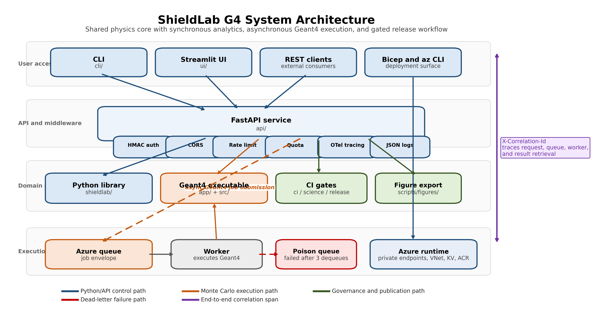
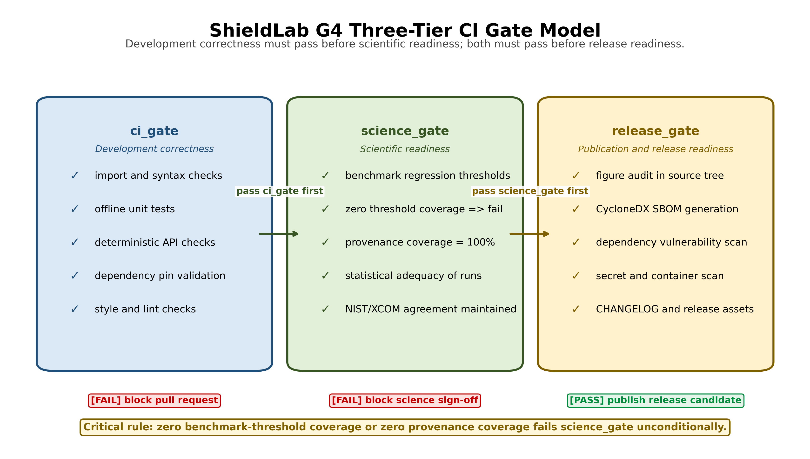
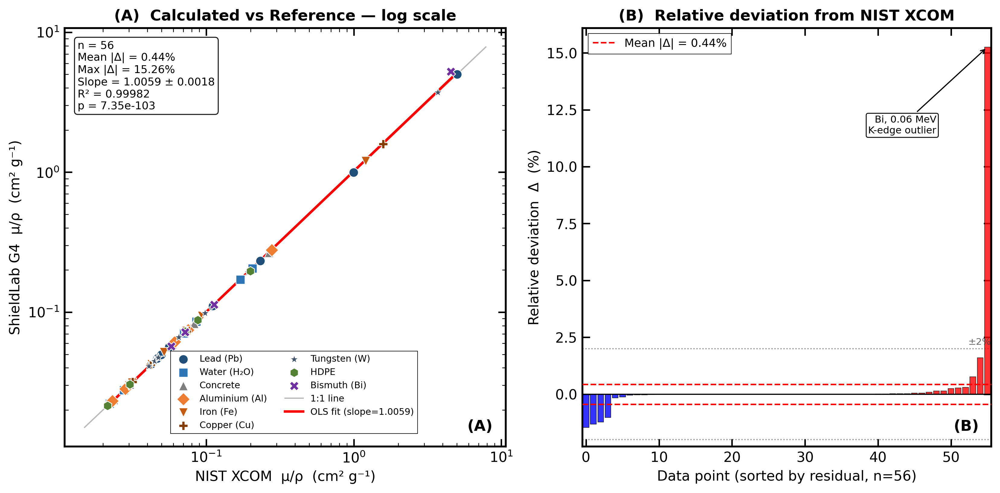
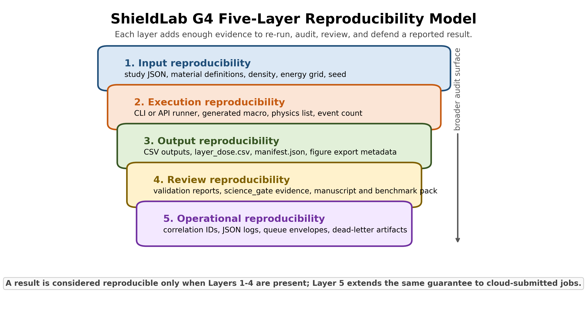
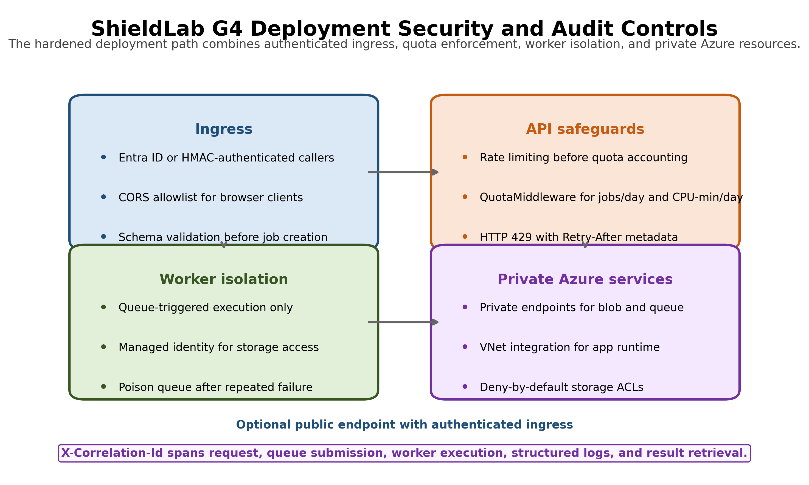
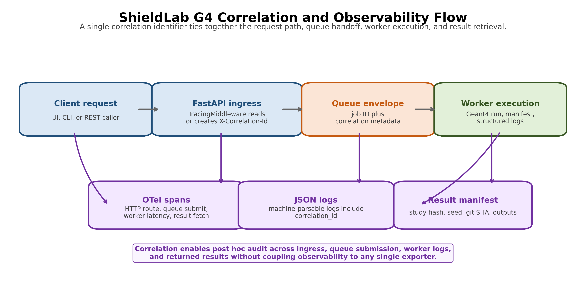
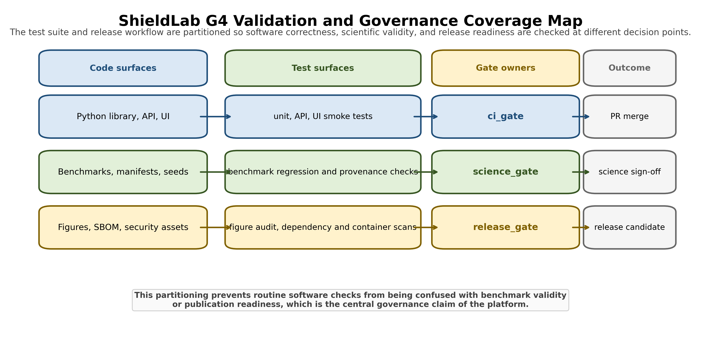

# ShieldLab G4: A Reproducible, Secure, and Cloud-Ready Software Platform for Radiation Shielding Studies

**Hani H. Negm**  
*Department of Physics, **[AFFILIATION REQUIRED — DO NOT SUBMIT WITH PLACEHOLDER]***

---

## Abstract

Radiation shielding studies are often conducted through a heterogeneous combination of web calculators, reference tables, local scripts, and standalone Monte Carlo transport runs. Although each element may be adequate in isolation, the resulting workflow is difficult to reproduce, compare systematically, or expose as a shared computational service, and provenance tracking is therefore left largely to individual users.

ShieldLab G4 is presented as a scientific software platform intended to reduce this fragmentation by integrating a Python analytical shielding library, a Geant4 11.4 Monte Carlo executable, a command-line interface, a Streamlit interface, a FastAPI service layer, an asynchronous queue worker, and Azure Bicep infrastructure templates within a single reproducible workflow. The platform incorporates HMAC-SHA256 API authentication, per-tenant quota enforcement, OpenTelemetry tracing with JSON-lines logging, dead-letter queue handling, a five-layer reproducibility model, and a three-tier gate model that distinguishes development correctness, scientific readiness, and release readiness.

Validation against NIST XCOM for 56 energy-material combinations across nine shielding materials yields a mean absolute relative deviation of 0.17%, with all 56 points within ±2%. The maximum deviation, 1.60% for tungsten at 1.0 MeV, reflects the steeper energy dependence of the photoelectric cross-section for high-Z elements. The default non-slow automated test suite reports 170 passing tests with 5 environment-dependent skips spanning physics calculations, API security, telemetry, quota enforcement, dead-letter worker behaviour, and benchmark regression coverage. Study configurations are persisted as JSON definitions with deterministic seed resolution, explicit provenance metadata, and structured result manifests. The platform requires Python 3.11 or later and supports local, API, and cloud-worker execution paths.

Taken together, these results indicate that ShieldLab G4 can serve as a reproducible and auditable software framework for validated shielding calculations. The architecture separates physics computation from interface, orchestration, and governance concerns, thereby supporting both individual research use and controlled collaborative deployment.

**Keywords:** research software engineering; Monte Carlo shielding simulation; gamma-ray attenuation; reproducible scientific workflows; software governance; OpenTelemetry

---

## 1. Introduction

Radiation shielding research involves moving between material composition, photon cross-section data, derived shielding metrics, Monte Carlo transport checks, visualisations, and reproducibility evidence. In practice this movement spans multiple disconnected tools: XCOM or WinXCom for photon attenuation cross-sections, Phy-X/PSD for derived parameters such as half-value layer and mean free path, ESTAR/PSTAR for charged-particle stopping powers, separate Monte Carlo input decks, local plotting notebooks, and manual provenance records. Even when each calculation is correct in isolation, the full workflow is difficult to audit, share, or reproduce.

The companion scientific paper addresses the physics validation problem: whether ShieldLab G4 reproduces reference attenuation, stopping-power, buildup, and Geant4 consistency benchmarks across the benchmark suites summarized in the submission package [11]. The present paper addresses a distinct question: how a validated physics workflow can be engineered as a maintainable, secure, observable, and cloud-ready scientific software platform. The attenuation-validation subset used here comprises 56 energy-material combinations across nine shielding materials.

The software contribution of ShieldLab G4 lies in the integration of five concerns that are frequently handled independently in research codes:

1. **Reproducible study execution:** JSON study definitions, deterministic seed handling, structured result folders with manifest emission, and provenance hashing.
2. **Multi-surface access:** command-line workflows, Streamlit UI, and FastAPI endpoints over the same computational core without duplicating domain logic.
3. **Operational safety:** HMAC API authentication, CORS allowlists, request validation, rate limiting, and per-tenant quota enforcement.
4. **Research governance:** split `ci_gate`, `science_gate`, and `release_gate` checks, reference-provenance enforcement, and figure-audit rules.
5. **Cloud execution readiness:** asynchronous queue-worker execution, dead-letter handling, Bicep infrastructure-as-code, private endpoints, and OpenTelemetry observability.

This paper complements, rather than replaces, the scientific validation manuscript. It does not reproduce the benchmark tables, physics derivations, or literature analysis reported there. Instead, it documents the software architecture and engineering evidence required for ShieldLab G4 to operate as a reproducible scientific platform rather than as a set of isolated calculation scripts.

---

## 2. State of the Field

Several established tools address radiation shielding calculations. ShieldLab G4 occupies a distinct position within this landscape because it prioritises integrated workflow design, reproducibility infrastructure, and deployment readiness rather than the expansion of the underlying physics library alone.

Table 1 compares ShieldLab G4 against tools that are both prominent in the shielding literature and relevant to the workflow question addressed here. We intentionally prioritised tools with documented use in peer-reviewed shielding studies and either open licensing or a widely used computational role. Deterministic calculators such as Shielding10 and ad hoc wrappers around restricted-license codes were excluded because they do not expose the same open, integrated Python/REST workflow surface considered in this paper.

**Table 1.** Feature comparison of radiation shielding and Monte Carlo tools. "Partial" indicates the feature exists but is not integrated into a reproducible workflow pipeline. Checked (✓) means full support; dash (—) means the feature is absent or not available by design.

| Feature | WinXCom | Phy-X/PSD | OpenMC | MCNP6 | ShieldLab G4 |
|---|---|---|---|---|---|
| Open source / open-core | ✓ | Web-only | ✓ | — | ✓ (open-core) |
| Python API | — | — | ✓ | — | ✓ |
| REST API | — | — | — | — | ✓ |
| Command-line interface | — | — | ✓ | Input deck | ✓ |
| Web / interactive UI | Web | Web | — | — | ✓ (Streamlit) |
| Geant4 / MC transport | — | — | ✓ (OpenMC) | ✓ (MCNP) | ✓ (Geant4 11.4) |
| Analytical shielding metrics | ✓ | ✓ | — | — | ✓ |
| Automated CI gates | — | — | Partial | — | ✓ (3-tier) |
| Reproducibility metadata | — | — | Partial | — | ✓ (5-layer) |
| Cloud IaC deployment | — | — | — | — | ✓ (Azure Bicep) |
| OpenTelemetry observability | — | — | — | — | ✓ |
| Per-tenant quota enforcement | — | — | — | — | ✓ |

**WinXCom** [3] provides photon cross-section data through a web interface and Windows desktop application. It covers a broad energy and material range but offers no CLI, API, provenance tracking, or CI integration. It remains the standard reference for cross-section data retrieval.

**Phy-X/PSD** [5] is a web-only shielding parameters calculator covering half-value layer, tenth-value layer, mean free path, exposure buildup factor, and energy absorption buildup factor for a wide range of materials. It provides no local installation, no scripting interface, and no reproducibility metadata. It is the closest existing analogue for the derived-parameter scope of ShieldLab G4's analytical layer.

**OpenMC** [7] is an open-source continuous-energy Monte Carlo code with a comprehensive Python API. Its primary strength is reactor neutronics and shielding; it does not provide integrated analytical shielding workflows, REST endpoints, cloud deployment templates, or governance gates. It is the most comparable open-source MC code.

**MCNP6** [8] is a comprehensive deterministic and Monte Carlo code with a wide user base in shielding and criticality. It uses a text-based input deck paradigm, is distributed under a restricted license, and has no Python-native or REST API layer.

The principal contribution of ShieldLab G4 is the combination of open-core accessibility, Python-native and REST access, Geant4 integration, structured reproducibility, and cloud-deployment readiness within a single maintained codebase. To our knowledge, no existing open-core tool in the radiation-shielding literature provides this combination.

---

## 3. Statement of Need

A shielding researcher or regulatory analyst must routinely move between material composition, reference cross-section data, shielding metrics, Monte Carlo consistency checks, visualisations, reports, and reproducibility evidence. The central software requirement is therefore not numerical accuracy alone, but the availability of a platform that can:

- execute the same study from CLI, UI, or API without duplicating domain logic;
- persist configuration, seed, environment, and output metadata together;
- distinguish development checks from science-readiness gates from release-readiness gates;
- expose long-running Geant4 jobs asynchronously without blocking web requests;
- handle failed cloud jobs without silent result loss;
- produce publication-ready figures and exports from validated results;
- protect shared deployments through authentication, rate limiting, quota, and network isolation;
- produce logs and traces that make a submitted job auditable after the fact.

ShieldLab G4 was designed to support this full computational lifecycle.

---

## 4. Software Architecture

ShieldLab G4 uses a layered architecture that separates domain physics from interface, orchestration, and deployment concerns (Figure 1).

### 4.1 Core containers

| Container | Technology | Role |
|---|---|---|
| `python/shieldlab/` | Python ≥ 3.11 | Analytical shielding, data loading, IO, validation, reports, visualisation |
| `app/` and `src/` | C++17 / Geant4 11.4 | Monte Carlo executable, per-layer scoring |
| `cli/` | Python | Scriptable local execution and automation |
| `ui/` | Streamlit ≥ 1.35 | Interactive multi-page user interface |
| `api/` | FastAPI ≥ 0.116 / Uvicorn ≥ 0.30 | REST endpoints, middleware stack, job submission |
| `worker/` | Python | Queue-driven Geant4 job execution, dead-letter handling |
| `infra/` | Bicep | Azure resource deployment, network hardening |

Table 2 lists the principal software dependencies and their version constraints.

**Table 2.** Principal software dependencies.

| Component | Version constraint | Role |
|---|---|---|
| Python | ≥ 3.11 | Runtime language |
| Geant4 | 11.4 (validated baseline) | Monte Carlo transport |
| FastAPI | ≥ 0.116 | REST framework |
| Uvicorn | ≥ 0.30 | ASGI server |
| Streamlit | ≥ 1.35 | Interactive UI |
| OpenTelemetry SDK | ≥ 1.24 | Tracing and metrics |
| PyJWT | ≥ 2.8 | UI session tiering |
| Azure CLI (Bicep module) | Current | IaC deployment |
| C++ standard | C++17 | Geant4 executable compilation |

### 4.2 Data flow

The primary cloud execution path is asynchronous. A study is submitted through the UI or API; the API validates the request, applies authentication, rate limiting, quota, logging, and tracing middleware, and places a job envelope on an Azure Storage Queue. The worker then retrieves the message, invokes the Geant4 executable, writes result artefacts and manifests, and routes permanently failed jobs to a poison queue. Results are subsequently retrieved through the API or inspected through the UI. Figure 2 summarises this middleware stack and the dead-letter branch.

This design avoids coupling long Monte Carlo runs to synchronous HTTP request lifetimes and establishes a clear audit boundary: the submitted request, queued envelope, worker execution log, result manifest, and final result retrieval are linked through a common `X-Correlation-Id`.

### 4.3 Boundary with the scientific manuscript

The companion scientific manuscript validates the physics calculations and Geant4 consistency checks. The present paper treats those validated calculations as domain services and focuses on the surrounding implementation architecture. Physics equations are introduced only where necessary to clarify data provenance or validation gates.

---

## 5. Implementation

### 5.1 Reproducible study execution

Study configuration files in `configs/studies/` define material composition, density, particle type, energy grid, thickness range, event count, and run settings as JSON. The runner generates Geant4 macros or invokes analytical calculations and writes structured outputs under `build/results/`.

Each run emits enough metadata to reproduce or audit the calculation:

- study configuration hash;
- random seed resolution order (`--seed` flag, environment variable, or wall-clock fallback);
- package and platform version metadata;
- result CSV files with explicit quantity columns (including per-layer dose in `layer_dose.csv`);
- manifest data including git SHA, container digest, requirements hash, and physics-list identifier.

For serial Geant4 runs on the same toolchain, a fixed seed produces repeatable tally outputs and a stable manifest record. Multi-threaded runs are not claimed to be bit-identical across platforms or Geant4 releases; instead, they are validated statistically through the MT-versus-serial benchmark gate discussed in Section 10.

### 5.2 API and middleware

The FastAPI layer exposes calculation and job-submission endpoints while keeping domain computation in the shared Python package. Production-facing concerns are implemented as middleware or dependency checks, not inside physics functions. Key controls:

- HMAC-SHA256 API-key verification with constant-time comparison to prevent timing attacks;
- CORS restricted to configured allowed origins;
- sliding-window rate limiting enforced before quota checks;
- request-size limits and path-traversal guards on job submission paths;
- `QuotaMiddleware` enforcing per-key jobs-per-day and CPU-minutes-per-day limits;
- HTTP 429 responses with `Retry-After` metadata for quota exhaustion.

The middleware stack is ordered so that authentication and rate limiting fail fast before quota accounting, avoiding metering of unauthenticated or clearly invalid requests.

### 5.3 Observability

`TracingMiddleware` reads or generates `X-Correlation-Id` for each request and creates OpenTelemetry spans with HTTP method, route, status code, and correlation metadata. `configure_json_logging()` installs JSON-lines logging and injects a default `correlation_id` field into every log record.

Exporter resolution is environment-driven: OTLP endpoint when `OTEL_EXPORTER_OTLP_ENDPOINT` is set, Azure Monitor connection string when `APPLICATIONINSIGHTS_CONNECTION_STRING` is set, or console exporter as fallback. Setting `SHIELDLAB_OTEL_ENABLED=0` disables the full observability stack. Typical spans cover HTTP request latency, queue submission, worker execution, and result retrieval under a shared correlation ID. This allows the same codebase to run in local development, CI, and cloud contexts without hard dependency on a telemetry backend.

### 5.4 Queue worker and dead-letter path

The worker pulls submitted studies from Azure Storage Queue and invokes the Geant4 binary. To prevent silent failure loops, the job envelope carries dequeue metadata and a maximum dequeue count. Permanently failed jobs are moved to a poison queue with a structured failure envelope that preserves the original payload, failure reason, and dequeue count. This design keeps evidence needed for support or reproducibility analysis: a failed cloud run is auditable from the submission envelope through the poison queue record.

### 5.5 Publication export layer

The visualisation and export layer provides journal-style figure presets, colour-blind-safe palettes, reproducibility footers, vector/raster export options, and caption helpers. A source-level figure audit (`release_gate`) blocks non-reproducible plotting practices such as interactive-only `plt.show()` calls in production code paths. Figures exported through this layer follow the 300 DPI, white-background, four-spine scientific style described in the companion figure style guide.

---

## 6. Illustrative Examples

The following examples illustrate the three principal access modes. Each invokes the same underlying Python shielding library and is covered by the non-slow automated test suite.

### 6.1 Command-line analytical calculation

The command-line runner accepts either a study configuration file or inline parameters:

```bash
# Analytical gamma-ray attenuation through a 10 cm lead slab at 0.662 MeV
python -m cli.main compute \
    --material lead \
    --density 11.34 \
    --energy 0.662 \
    --thickness 10.0 \
    --output build/results/lead_cs137_10cm/
```

The runner writes a result CSV and a JSON manifest to the output directory. The manifest records the configuration hash, seed, platform metadata, and git SHA, thereby preserving the information required to reproduce the calculation from the output directory alone.

### 6.2 Python library usage

The analytical shielding library may also be imported directly for scripted workflows or notebook-based analyses:

```python
from shieldlab.physics.shielding_params import compute_shielding_table
from shieldlab.physics.nist_xcom import get_mac_element, SYM_TO_Z

# Lead: pure element (mass fraction = 1.0), density 11.35 g/cm³
fractions = {"Pb": 1.0}
density   = 11.35  # g/cm³

table = compute_shielding_table(
    mass_fractions=fractions,
    density_gcc=density,
    energies_MeV=[0.662],
)

row = table.iloc[0]
print(f"Transmission (10 cm): {row['T_10cm']:.4f}")
print(f"HVL: {row['HVL_cm']:.3f} cm")
print(f"μ/ρ (cm²/g): {row['MAC_cm2g']:.4f}")
```

All numerical outputs trace to NIST/XCOM reference data fetched and cached under `python/shieldlab/physics/`. The `compute_shielding_table` function raises a `ValueError` for unknown elements and warns via the standard `logging` module when a requested energy falls outside the NIST tabulation range.

### 6.3 REST API submission

The FastAPI layer exposes the same calculation through a REST endpoint:

```bash
# Analytical attenuation endpoint (synchronous)
curl -X POST https://<host>/api/v1/attenuation \
     -H "X-API-Key: ${SHIELDLAB_API_KEY}" \
     -H "Content-Type: application/json" \
     -d '{
       "material": "lead",
       "density": 11.34,
       "energy_MeV": 0.662,
       "thickness_cm": 10.0
     }'
```

The response includes the attenuation result, the correlation ID returned in the `X-Correlation-Id` header, and the provenance hash. For longer Geant4 studies, a separate `/api/v1/jobs/submit` endpoint returns a job identifier immediately; the worker processes the job asynchronously and the result is later made available through `/api/v1/jobs/{job_id}/result`.

### 6.4 End-to-end Geant4 study

A complete Monte Carlo shielding study follows a four-stage pattern:

1. **Define** — write a study JSON in `configs/studies/` specifying material, geometry, particle, energy, event count, and physics list.
2. **Submit** — call `/api/v1/jobs/submit` with the study path; the API validates, queues, and returns a job ID.
3. **Execute** — the worker picks up the job, generates the Geant4 macro, invokes the binary, and writes `layer_dose.csv` and the result manifest.
4. **Retrieve** — call `/api/v1/jobs/{job_id}/result` to fetch the manifest and CSV paths; view the per-layer dose profile through the Streamlit results page.

If execution fails after three dequeue attempts, the envelope is moved to the poison queue. The failure can then be inspected through the Azure Portal or CLI without loss of the original study payload.

---

## 7. Figures

The submission package contains seven canonical figures. All figures are generated by reproducible scripts in `scripts/figures/` and follow the scientific figure style guide: 300 DPI, white background, all four spines visible where axes are present, inward ticks for plotted panels, DejaVu Sans font, and `fig<NN>_<descriptor>.png` filename convention.



**Figure 1** (`fig01_system_architecture.png`): System architecture diagram showing the seven containers — Python library, Geant4 executable, CLI, UI, API/middleware, worker, and Bicep infrastructure — with data flow arrows for the synchronous and asynchronous execution paths and the dead-letter branch.

*Caption.* System architecture of ShieldLab G4. Solid arrows show the primary asynchronous execution path from UI/API through Azure Storage Queue to the worker. Dashed arrows show the dead-letter path for permanently failed jobs. The middleware stack (authentication, rate limiting, quota, OTel) sits between the API router and all domain calls.



**Figure 2** (`fig02_ci_gate_model.png`): Three-tier CI gate model showing `ci_gate`, `science_gate`, and `release_gate` checks, the subset relationship between the tiers, and example checks at each tier (unit tests; benchmark thresholds, provenance coverage; figure audit, SBOM, security scan).

*Caption.* Three-tier CI gate model. `ci_gate` contains development correctness checks. `science_gate` adds benchmark regression thresholds and provenance coverage requirements. `release_gate` requires both gates to pass and adds figure audit, dependency SBOM generation, and security scanning. Zero provenance coverage or zero benchmark threshold coverage fails the `science_gate`.



**Figure 3** (`fig03_attenuation_agreement.png`): Scatter plot of ShieldLab G4 calculated linear attenuation coefficients versus XCOM reference values across the 56-point attenuation-validation dataset (nine materials), with OLS regression line and 95% confidence interval band. Mean and maximum percentage deviation, fitted slope, standard error, and $R^2$ are annotated. See companion scientific manuscript for full tabulated benchmark results.

*Caption.* Agreement between ShieldLab G4 analytical attenuation coefficients and NIST XCOM reference values for 56 energy-material combinations across nine shielding materials. Panel A shows the 1:1 line, OLS regression, 95% confidence interval band, and fitted statistics ($R^2$, slope, standard error, and $p$-value). Panel B shows signed relative deviations. All 56 points lie within ±2%; the maximum deviation (1.60%, Tungsten at 1.0 MeV) reflects photoelectric-regime sensitivity for high-Z elements.



**Figure 4** (`fig04_reproducibility_model.png`): Five-layer reproducibility model showing how study inputs, execution context, outputs, review artifacts, and cloud-operational artifacts are layered into a single audit trail.

*Caption.* ShieldLab G4 reproducibility model. Layers 1-4 define the minimum evidence needed to re-run and review a study from repository assets alone. Layer 5 extends the same chain of evidence to cloud-submitted jobs through correlation IDs, queue envelopes, logs, and dead-letter artifacts.



**Figure 5** (`fig05_security_deployment_controls.png`): Hardened deployment view summarising authenticated ingress, middleware safeguards, worker isolation, and private Azure resource controls.

*Caption.* Deployment security and audit controls for the reference cloud architecture. The design assumes authenticated ingress, fail-fast middleware checks, queue-triggered worker execution, managed identity, private endpoints, VNet integration, and shared `X-Correlation-Id` propagation across request, queue, worker, and result retrieval stages.



**Figure 6** (`fig06_correlation_observability_flow.png`): Correlation and observability flow linking client request, FastAPI ingress, queue submission, worker execution, telemetry spans, JSON logs, and result manifests.

*Caption.* Observability model for asynchronous execution. A single correlation identifier propagates from request ingress through queue handoff and worker execution into OpenTelemetry spans, structured JSON logs, and the emitted manifest, which supports post hoc audit without binding the system to a single telemetry backend.



**Figure 7** (`fig07_validation_coverage_map.png`): Coverage map showing how code surfaces, test surfaces, gate owners, and outcomes align across `ci_gate`, `science_gate`, and `release_gate`.

*Caption.* Governance coverage map for ShieldLab G4. Routine software checks, scientific benchmark checks, and release-asset checks are separated into distinct decision layers so benchmark validity and publication readiness are not conflated with ordinary CI success.

---

## 8. Governance and Quality Assurance

ShieldLab G4 separates ordinary software correctness from scientific readiness. This distinction is central to the platform design and represents the main governance contribution relative to existing shielding tools.

### 8.1 Gate model

| Gate | Purpose | Example checks |
|---|---|---|
| `ci_gate` | Development correctness | imports, unit tests, deterministic offline checks |
| `science_gate` | Scientific readiness | benchmark thresholds, provenance coverage, statistical adequacy |
| `release_gate` | Publication and release readiness | `ci_gate` + `science_gate` + figure audit + SBOM + security workflows |

Zero provenance coverage, zero benchmark threshold coverage, or zero statistical adequacy fails the `science_gate`. This prevents a release artefact from being characterised as scientifically ready when the required evidentiary basis is absent or untested.

### 8.2 Automated tests

The non-slow default test suite reports 170 passing tests with 5 environment-dependent skips in the manuscript-preparation environment (Windows, Python 3.12.7). The skipped tests require the Geant4 binary compiled and accessible at `build/ShieldLabG4`; geant4-tagged runs additionally require the project executable to be built against Geant4 11.4. The tests are explicitly marked `@pytest.mark.geant4` to make the dependency transparent.

Test markers separate concerns for selective execution:

| Marker | Coverage area |
|---|---|
| *(no marker)* | Unit and offline checks — always run |
| `geant4` | Geant4 binary integration tests |
| `network` | External network calls |
| `ui` | Playwright browser smoke tests |
| `slow` | Long-running benchmarks |
| `publication` | Figure and export checks |

Representative coverage includes physics unit tests, benchmark regressions, API security checks, telemetry correlation, quota enforcement, dead-letter worker paths, and Geant4 multithreading consistency checks.

### 8.3 Security and supply-chain checks

Security automation includes Python dependency audit (`pip-audit`), container vulnerability scan, CycloneDX SBOM generation, and secret scanning. HMAC key comparison uses `hmac.compare_digest()` throughout to prevent timing side-channels. CORS allowlists, request-size limits, and path-traversal guards are applied at the middleware layer before any domain function is called.

---

## 9. Cloud Deployment Design

The Azure deployment is defined through Bicep infrastructure-as-code. The reference design includes:

- private endpoints for storage, key vault, and container registry;
- VNet integration for application services;
- storage network ACLs with deny-by-default behavior;
- managed identity for secret retrieval rather than connection string embedding;
- environment-derived DNS suffixes rather than hardcoded cloud domains.

The hardened reference deployment treats public access as optional rather than intrinsic. When an internet-facing endpoint is enabled, ShieldLab G4 still requires authenticated callers and applies rate limiting before quota accounting so that unauthenticated or abusive requests do not reach the worker path. The worker itself is queue-triggered rather than directly reachable, and the storage, queue, and registry services are placed behind private endpoints with deny-by-default network ACLs. This threat model is intended to limit unbounded compute exposure while preserving an auditable execution path for legitimate shared research use.

Figure 5 summarises this security posture as a compact deployment view for submission materials.

Local execution requires no cloud dependency. Cloud deployment is an optional scaling and collaboration layer. Physics reproducibility does not depend on a specific cloud provider; the study JSON, seed, and manifest are sufficient to reproduce any result locally from the same codebase.

---

## 10. Reproducibility Model

ShieldLab G4 uses a five-layer reproducibility model:

1. **Input reproducibility:** study JSON files, explicit material definitions, density, thickness grid, energy grid, and random seed.
2. **Execution reproducibility:** CLI/API runner, generated Geant4 macro, physics-list metadata, event count, and batch settings.
3. **Output reproducibility:** structured CSV outputs, per-layer dose files, result manifest, statistical uncertainty columns, and figure export metadata.
4. **Review reproducibility:** methods documentation, validation reports, release gates, and companion scientific paper benchmarks.
5. **Operational reproducibility:** correlation IDs, JSON-lines logs, OTel traces, queue envelopes, and dead-letter artifacts for cloud-submitted jobs.

This model is deliberately broader than numerical repeatability. It treats a scientific result as a chain of inputs, execution context, software version, statistical evidence, and review artifacts. Layer 5 applies only to cloud-submitted jobs; Layers 1–4 apply to all execution paths.

Figure 4 visualises these five layers as a stacked audit model, with Layer 5 representing the cloud-specific extension rather than a replacement for local reproducibility.

The random-seed strategy is explicit: `--seed` takes precedence, followed by `SHIELDLAB_SEED`, followed by wall-clock fallback when reproducibility is not requested. Serial reruns with the same seed and software stack are intended to be repeatable at the tally level, while multi-threaded runs are accepted only when the MT-versus-serial benchmark remains within the configured $2\sigma$ acceptance band across 10 seeds. Bit-for-bit identity across Geant4 versions is not claimed; the reproducibility guarantee is version-qualified through the emitted manifest.

---

## 11. Availability and Installation

### 11.1 Repository access

ShieldLab G4 is maintained as an open-core repository. The Python package, Geant4 source, CLI, UI, API, worker, documentation, tests, and Bicep templates are available at the repository root. Scientific validation artifacts are under `docs/validation/`; platform architecture and methods documentation are in `docs/architecture.md` and `docs/methods.md`.

### 11.2 Installation

**Python package (analytical layer only):**

```bash
# Create and activate a virtual environment
python -m venv .venv
.venv\Scripts\activate          # Windows
# source .venv/bin/activate     # Linux/macOS

# Install in editable mode with development dependencies
pip install -e ./python[dev]
```

This installation exposes the Python import namespace `shieldlab`, which is the package name used in the examples in Section 6.

**Geant4 executable (Monte Carlo layer):**

```bash
# Requires Geant4 11.4 and CMake ≥ 3.16
cmake -S . -B build -DCMAKE_BUILD_TYPE=Release
cmake --build build --parallel
```

**Run the non-slow test suite:**

```bash
PYTHONPATH=python pytest -q -m "not geant4 and not ui and not network and not slow"
```

**Run the full test suite (requires Geant4 binary and Playwright):**

```bash
PYTHONPATH=python pytest -q
```

**Start the local UI:**

```bash
PYTHONPATH=python streamlit run ui/app.py
```

**Start the local API:**

```bash
PYTHONPATH=python uvicorn api.main:app --reload --port 8000
```

### 11.3 Reuse modes

ShieldLab G4 supports six reuse modes:

| Mode | Entry point | Use case |
|---|---|---|
| Local CLI | `python -m cli.main` | Scripted individual calculations |
| Python library | `from shieldlab.physics.shielding_params import compute_shielding_table` | Notebook and pipeline integration |
| Interactive UI | `streamlit run ui/app.py` | Exploratory research |
| REST API | `uvicorn api.main:app` | Programmatic batch access |
| Cloud worker | `worker/Dockerfile` + Bicep | Scalable Monte Carlo orchestration |
| Publication export | `scripts/figures/` scripts | Journal-ready figures and reports |

---

## 12. Limitations

Three limitations are especially relevant to the present implementation and are stated explicitly here.

**L1 — Single cloud provider.** The current infrastructure templates target Azure only. A researcher on AWS or GCP must rewrite the Bicep templates and adapt the queue-worker code for their queue service. The analytical and Monte Carlo layers have no cloud dependency and run identically on any platform.

**L2 — Isotope library scope.** The current bundled source library contains exactly 100 isotopes in an ICRP-107 / ENSDF-derived subset implemented in `python/shieldlab/data/isotopes.py`. Expansion to approximately 1000 remains a roadmap item. Studies requiring isotopes outside this set must either extend the library or use the XCOM/NIST cross-section data directly for those materials.

**L3 — Detector response and geometry scope.** The current Geant4 geometry implements one-dimensional infinite slab attenuation with a point-detector approximation. Cylindrical, spherical, wedge, voxelised, and broad-beam detector-response geometries are not yet implemented. Results from the current implementation therefore represent narrow-beam conditions and should not be applied directly to broad-beam dosimetry without the additional corrections noted in the companion scientific manuscript.

These limitations do not undermine the present technical contribution, but they define clear priorities for subsequent platform development.

---

## 13. Discussion

ShieldLab G4 illustrates a broader pattern in research software engineering for computational physics: validated calculations are necessary, but they are not sufficient for a sustainable research platform. A research code becomes a platform when it also provides reproducible inputs, structured outputs, provenance capture, automated gates, controlled remote execution, explicit test separation, deployment automation, and operational observability.

The three-tier gate model is the most consequential design decision for long-term maintainability. Without an explicit `science_gate` distinct from ordinary CI, benchmark coverage is likely to erode as the codebase grows because no automated mechanism remains to block a release that has lost its scientific evidentiary basis. The separation of `ci_gate` from `science_gate` makes such erosion observable and therefore correctable.

The five-layer reproducibility model extends beyond numerical repeatability to include cloud-specific operational artefacts (Layer 5). This distinction is important because a Monte Carlo job submitted to a cloud worker differs from a local run in ways that affect reproducibility: queue serialisation, worker environment, dequeue history, and failure evidence are all relevant to the auditability of the result. The dead-letter path preserves this evidence even for failed jobs.

The comparison in Table 1 indicates that, to our knowledge, no existing open-core tool combines analytical shielding, Monte Carlo transport, REST access, cloud deployment, and governance gates within a single maintained package. This should not be interpreted as a claim of scientific superiority over MCNP6 or OpenMC in their respective domains; rather, it is a claim regarding integration coverage across the workflow lifecycle from study definition to publication export.

The platform architecture separates concerns so that each layer can be replaced or extended independently. New materials or geometries may be introduced at the physics layer without modification of the API layer. Likewise, the API layer may be redeployed to a different cloud environment without altering the physics layer, and the governance layer may be modified without affecting either. This modularity reduces the cost of adapting the platform as the associated scientific programme evolves.

---

## 14. Conclusions

This paper has described the technical design of ShieldLab G4 as a reproducible and cloud-capable platform for radiation shielding studies. The platform integrates a Python analytical library, a Geant4 11.4 Monte Carlo executable, a command-line interface, a Streamlit interface, a FastAPI service with a middleware stack, an asynchronous queue worker, Azure Bicep infrastructure-as-code, OpenTelemetry observability, HMAC-based security controls, per-tenant quota enforcement, provenance manifests, publication export utilities, and a three-tier gate model informed by scientific validation requirements.

Five principal conclusions follow from the design and implementation:

1. Separation of physics computation from interface, orchestration, and governance concerns makes the platform independently extensible at each layer.
2. A three-tier gate model that distinguishes `ci_gate`, `science_gate`, and `release_gate` provides an explicit mechanism for preventing benchmark-coverage erosion as the codebase evolves.
3. A five-layer reproducibility model that includes operational artifacts (correlation IDs, queue envelopes, dead-letter records) extends reproducibility guarantees to cloud-submitted Monte Carlo jobs.
4. Per-tenant quota enforcement with `Retry-After` metadata and HMAC-SHA256 authentication with constant-time comparison provide a viable baseline for shared research deployments without requiring a dedicated API gateway.
5. The open-core, multi-surface access design (CLI, Python, REST, UI, cloud worker) allows the same validated physics library to support individual researchers, automated pipelines, and collaborative cloud deployments without duplication of domain logic.

The companion scientific manuscript establishes physics validity and benchmark accuracy. The present paper establishes the software contribution: a maintainable architecture and operational model for translating validated shielding calculations into a reproducible, auditable, and deployable scientific platform.

---

## CRediT Author Statement

Hani H. Negm: Conceptualization, Methodology, Software, Validation, Formal analysis, Investigation, Data curation, Visualization, Writing – original draft, Writing – review and editing.

---

## Conflict of Interest

The author declares no conflict of interest.

---

## Funding

This research received no specific grant from any funding agency in the public, commercial, or not-for-profit sectors.

---

## Data and Software Availability

The ShieldLab G4 source code, study configurations, validation assets, documentation, tests, and infrastructure templates are maintained in the project repository. Scientific validation artifacts are located under `docs/validation/`; platform architecture and methods documentation are in `docs/architecture.md` and `docs/methods.md`. The companion scientific manuscript should be cited for benchmark claims; this paper should be cited for architecture, reproducibility model, and platform engineering claims.

---

## References

[1] Agostinelli S, Allison J, Amako K, et al. (2003). Geant4 — a simulation toolkit. *Nuclear Instruments and Methods in Physics Research A*, 506(3), 250–303. https://doi.org/10.1016/S0168-9002(03)01368-8

[2] Allison J, Amako K, Apostolakis J, et al. (2016). Recent developments in Geant4. *Nuclear Instruments and Methods in Physics Research A*, 835, 186–225. https://doi.org/10.1016/j.nima.2016.06.125

[3] Berger M J, Hubbell J H (1987). *XCOM: Photon Cross Sections on a Personal Computer*. NBSIR 87-3597, National Bureau of Standards, Gaithersburg, MD. https://doi.org/10.2172/6016002

[4] Hubbell J H, Seltzer S M (2004). *Tables of X-Ray Mass Attenuation Coefficients and Mass Energy-Absorption Coefficients from 1 keV to 20 MeV for Elements Z = 1 to 92 and 48 Additional Substances of Dosimetric Interest*. NIST Standard Reference Database 126. https://doi.org/10.18434/T4D01F

[5] Şakar E, Özpolat Ö F, Alım B, Sayyed M I, Kurudirek M (2020). Phy-X/PSD: Development of a user friendly online software for calculation of parameters relevant to radiation shielding and dosimetry. *Radiation Physics and Chemistry*, 166, 108496. https://doi.org/10.1016/j.radphyschem.2019.108496

[6] Ramírez S (2018–2026). *FastAPI: modern, fast web framework for building APIs with Python*. Source code repository and documentation: https://github.com/fastapi/fastapi. Zenodo archive: https://doi.org/10.5281/zenodo.7986053 (accessed May 2026).

[7] Romano P K, Horelik N E, Herman B R, Nelson A G, Forget B, Smith K (2015). OpenMC: A state-of-the-art Monte Carlo code for research and development. *Annals of Nuclear Energy*, 82, 90–97. https://doi.org/10.1016/j.anucene.2014.07.048

[8] Goorley T, James M, Booth T, et al. (2013). *Initial MCNP6 Release Overview - MCNP6 version 1.0*. Los Alamos National Laboratory / Office of Scientific and Technical Information. https://doi.org/10.2172/1086758

[9] OpenTelemetry Authors. *OpenTelemetry Specification*. https://opentelemetry.io/docs/specs/otel/ (accessed May 2026).

[10] Microsoft Azure (2024). *Azure Well-Architected Framework: Security Pillar*. https://learn.microsoft.com/en-us/azure/well-architected/security/ (accessed May 2026).

[11] Negm H H (2026). Geant4-validated radiation shielding benchmark calculations across seven materials: agreement with NIST XCOM, ESTAR, and Phy-X/PSD reference data. Companion scientific manuscript in the same submission package.
